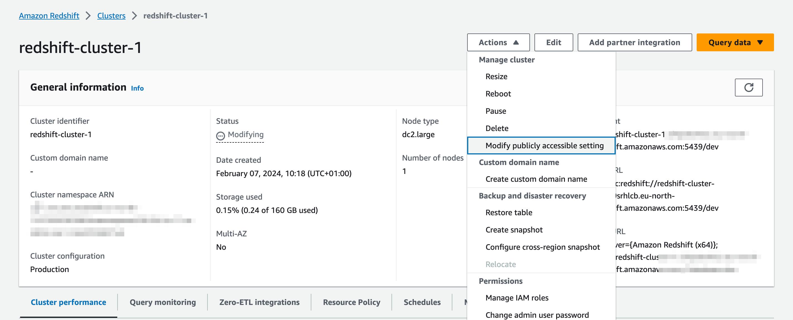
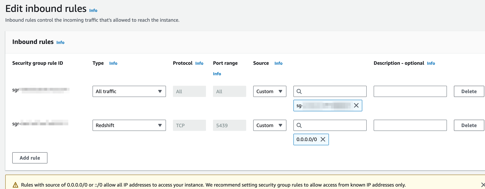

# Redshift

In order to have set up a Redshift connection, you need to add a configuration item to `connections` in the `.bruin.yml` file complying with the following schema
Mind that, despite the connection being at all effects a Postgres connection, the default `port` field of Amazon Redshift is `5439`.

```yaml
    connections:
      redshift:
        - name: "connection_name"
          username: "awsuser"
          password: "XXXXXXXXXX"
          host: "redshift-cluster-1.xxxxxxxxx.eu-north-1.redshift.amazonaws.com"
          port: 5439
          database: "dev"
          ssl_mode: "allow"
```

`ssl_mode` should be one of the modes describe in the [postgres documentation](https://www.postgresql.org/docs/current/libpq-ssl.html#LIBPQ-SSL-PROTECTION).

## Making Redshift publicly accessible

Before the connection works properly, you need to ensure that the Redshift cluster can be access from the outside. In order to do that you must mark the configuration option in your redshift cluster



In addition to this, you must configure the inbound rules of the security group your redshift cluster belongs to, to accept inbound connections. In the example below we enabled access for all origins but you can set more restrictive rules for this.



If you have trouble setting this up you can check [Aws documentation](https://repost.aws/knowledge-center/redshift-cluster-private-public) on the topic

