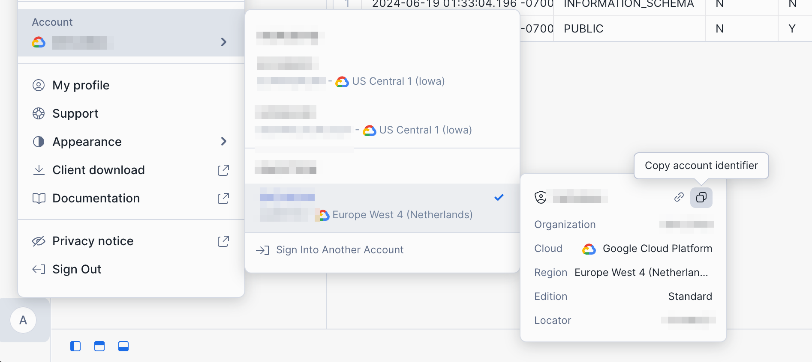
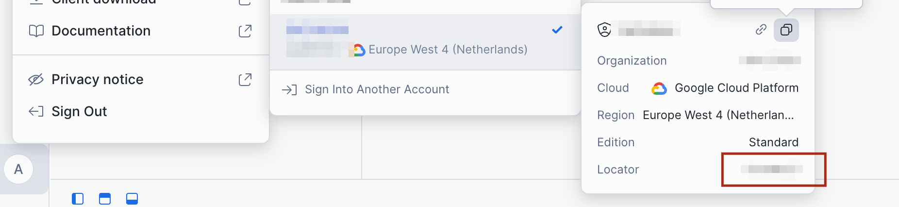

# Snowflake

In order to have set up a Snowflake connection, you need to add a configuration item to `connections` in the `.bruin.yml` file.

There's 2 different ways to fill it in

```yaml
    connections:
      snowflake:
        - name: "connection_name"
          username: "sfuser"
          password: "XXXXXXXXXX"
          account: "AAAAAAA-AA00000"
          database: "dev"
          schema: "schema_name" # optional
          warehouse: "warehouse_name" # optional
          role: "data_analyst" # optional
          region: "eu-west1" # optional
```

Where account is the identifier that you can copy here:



A different way to do this is to use the account locator (If you are using cloud and running dbt pipelines in snowflake this should be the connection config)

```yaml
      connections:
      snowflake:
        - name: "connection_name"
          username: "sfuser"
          password: "XXXXXXXXXX"
          account: "AAAAAAA.<region>" # account locator with region suffix
          database: "dev"
          schema: "schema_name" # optional
          warehouse: "warehouse_name" # optional
          role: "data_analyst" # optional
          region: "eu-west1.gcp" # DEPRECATED: Append the region directly to the accountname, e.g., `account: "AAAAAAA.<region>"` or `account: "AAAAAAA

```

Where account locator is found here 




