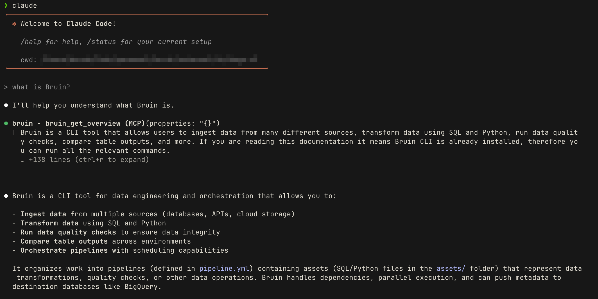

# Bruin MCP
Bruin is a CLI tool that allows users to ingest data from many different sources, transform data using SQL, Python, and R, run data quality checks, compare table outputs, and more.



Bruin MCP allows you to extend your AI agents to analyze, understand, and build upon your data using Bruin CLI. It allows AI agents to query data, compare tables, ingest data, and build pipelines on them.

## Setup
:::tip
Please make sure you have [Bruin CLI installed](/getting-started/introduction/installation.md).
:::

### Claude Code

To use Bruin MCP in Claude Code, run the following command in your terminal:

```bash
claude mcp add bruin -- bruin mcp
```

### Cursor IDE & Cursor CLI

To use Bruin MCP in Cursor IDE, go to Cursor Settings > MCP & Integrations > Add Custom MCP, then add the following configuration to the configuration file:

```json
{
  "mcpServers": {
    "bruin": {
      "command": "bruin",
      "args": ["mcp"]
    }
  }
}
```

### Codex CLI

To use Bruin MCP in Codex CLI, add the following configuration to your `~/.codex/config.toml` file:

```toml
[mcp_servers.bruin]
command = "bruin"
args = ["mcp"]
```

## Bruin Environment Setup
In order to make use of Bruin MCP, you need to have a Bruin project. A Bruin project is a folder that contains a `.bruin.yml` file.

The simplest way to get started is to create a new Bruin project using `bruin init` command.
```bash
# Initialize a new Bruin project with a DuckDB template
bruin init duckdb

# If you don't give any arguments, it will ask you to select a template
bruin init
```

This will create a new Bruin project with a DuckDB database as a starting point. 

You can 
- [read more about credentials](/getting-started/credentials) for your data warehouse or other sources, 
- you can [programmatically add connections](/commands/connections#add-connection),
- you can use our [VS Code / Cursor extension](/vscode-extension/overview) to add connections.

Bruin allows you to use different environments for your projects. You can [read more about environments](/getting-started/devenv) to learn more.


## Usage

There are a couple of areas Bruin MCP can be helpful for you. Bruin CLI has complete functionality, and MCP is a simple layer to bridge the gap between the CLI and the AI editor.

### Analyzing data
Bruin CLI already has the ability to run queries across different databases. MCP server allows your AI agents to understand how to run queries on the given databases.

A common example is to ask the AI agent to analyze a data in a certain table, such as "What is the average revenue of the products in the products table?" or "What is the total revenue of the orders in the orders table?"

### Data ingestion
Bruin already has connectors for [tens of sources](/ingestion/overview), Bruin MCP allows your AI agents to understand how to ingest data from the given sources.

You can use Bruin MCP to get data from Shopify, for instance. You can simply say "bring all of my Shopify order data into BigQuery", and just enjoy the rest.

### Data comparison
A common task when dealing with changes in data pipelines is to compare data between two different environments. You create a new version of the table in your development environment, and you want to compare it with the production table to make sure it's correct.

Thankfully, Bruin CLI already supports:
- [development environments](/getting-started/devenv)
- [data-diff](/commands/data-diff) command

Using the Bruin MCP server, you can build new data models while ensuring that the data is correct and up-to-date using AI.

## And more

Once MCP setup is complete, you can ask questions in Cursor IDE or Claude Code like:

- "How do I create a BigQuery asset in Bruin?"
- "How is a pipeline.yml file configured in Bruin?"
- "What data sources does Bruin support for ingestion?"
- "How do I set up a Snowflake connection in Bruin?"
- "How can I connect to my PostgreSQL database and run a query with Bruin?"
- "How do I create a table in my data warehouse using Bruin?"
- "How can I build a data pipeline in Bruin for ingesting CSV files?"
- "How do I run data quality checks on my tables in Bruin?"

Or you can give direct commands like:

- "Create a BigQuery asset in Bruin"
- "Configure a pipeline.yml file in Bruin"
- "Show me the data sources Bruin supports for ingestion"
- "Set up a Snowflake connection in Bruin"
- "Connect to my PostgreSQL database and run a query with Bruin"
- "Create a table in my data warehouse using Bruin"
- "Build a data pipeline in Bruin for ingesting CSV files"
- "Run data quality checks on my tables in BVruin"

The AI assistant will answer these questions using up-to-date Bruin documentation and provide you with accurate examples. It can also execute Bruin commands directly to help you connect to databases, run queries, perform ingestion tasks, and create complete data pipelines.

## Feedback

We'd love to hear your feedback on Bruin MCP. Please [create an issue](https://github.com/bruin-data/bruin/issues/new) so that we can improve Bruin CLI & Bruin MCP.

