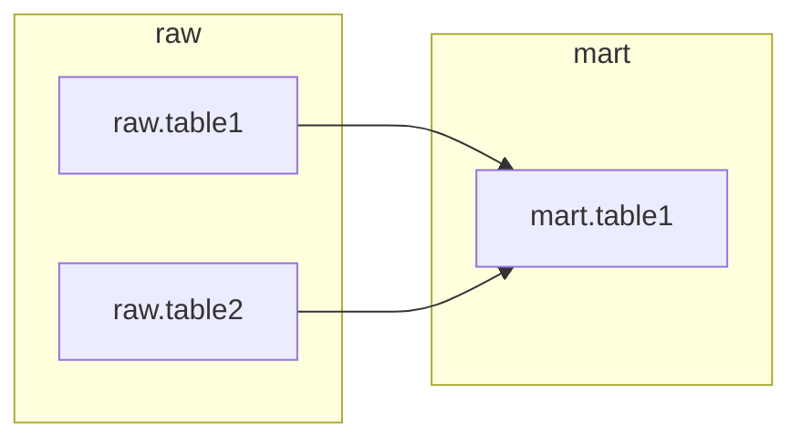
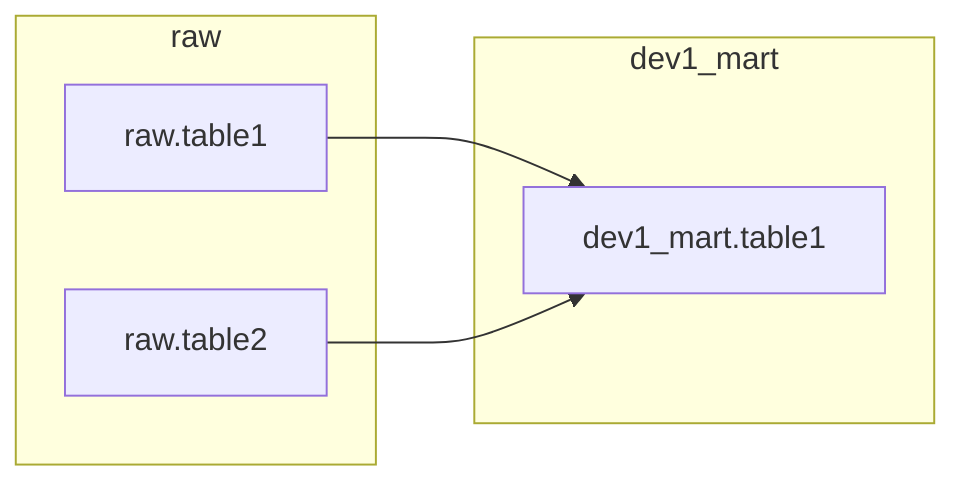
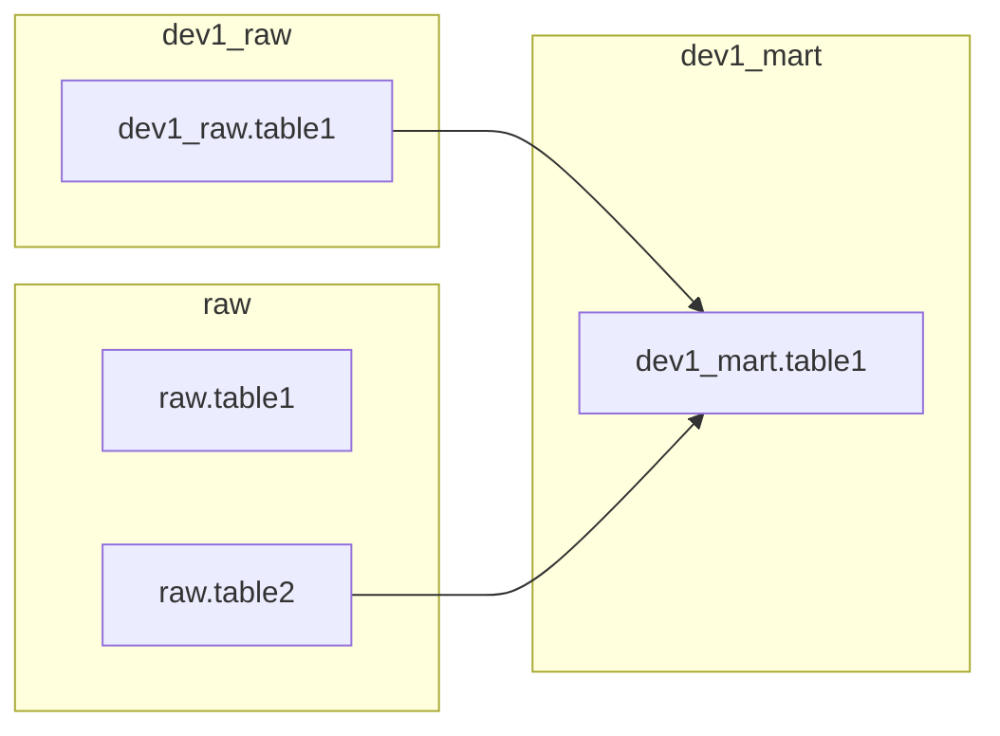
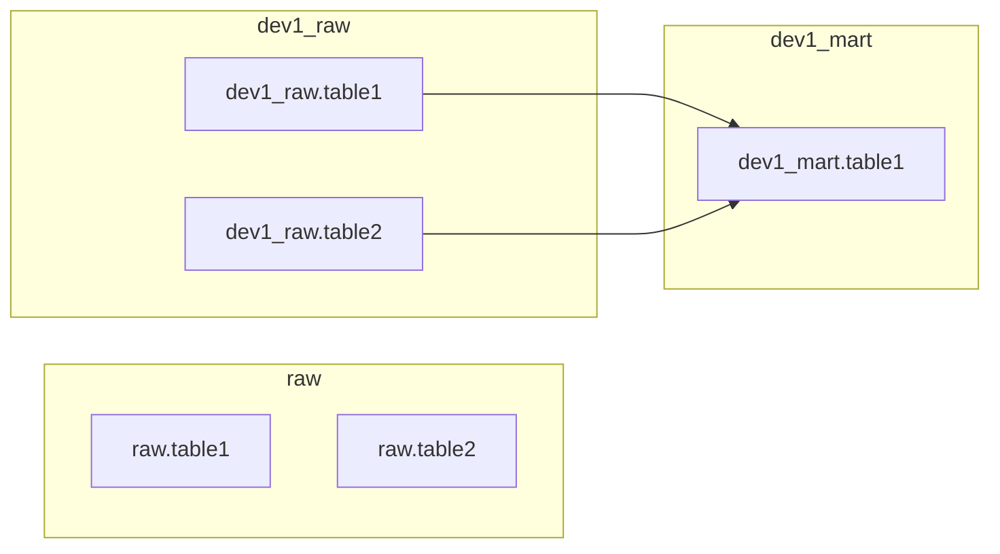

# Developer Environments

Bruin has native support for running the same pipeline against multiple environments. This feature is very useful for testing and development, as it allows you to quickly switch between different environments without having to change your code.

You can think of development environments as:
- **Staging**: A staging environment is a replica of the production environment. It is used to test new features and changes before they are deployed to production.
  - Staging environments often replicate the production data, using different databases and platforms to test and develop features. 
  - Teams may decide on whether to have shared staging environments vs separate environments per person.
- **Production**: The production environment is the live environment where the application is running. It is used by end users and customers.

You can define as many environments as you would like with Bruin, and run the same code against them.

## Setting up a development environment
Bruin manages all the credentials for different environments in your `.bruin.yml` file. In this file, you can define as many environments as you would like under the `environments` key.

```yaml
default_environment: staging
environments:
  staging:
    connections:
      generic:
        - name: MY_SECRET
          value: secretvalue
      duckdb:
        - name: "duckdb-default"
          path: "chess.db"
      chess:
        - name: "chess-default"
          players:
            - "MagnusCarlsen"
            - "Hikaru"

  production:
    connections:
      generic:
        - name: MY_SECRET
          value: someothersecret
  
  some_other_env:
    connections:
      generic:
        - name: MY_SECRET
          value: someotherdifferentsecret
```

You can use different environments per each invocation by simply giving the name of the environment with the `--environment` flag.

```bash
bruin run --environment staging
```

### Limitations
Bruin is built around asset names having `<schema>.<table>` naming convention, which means that if you want to run the same code against a different environment, that new environment needs to be a separate database.

Imagine having Postgres as your data warehouse, you would effectively set up a different database within postgres for each development environment, that way you can create the same schema/table/view in each environment without impacting them.

While this approach works fine, there are some scenarios where it might not be beneficial, especially where:
- having replica environments is not possible since the data is too large;
- or, the source data is not accessible from other databases via cross-database queries, e.g. Redshift.

In these scenarios, we recommend using different schemas per environment within the same database, as described below.


## Schema-based Environments

Due to the limitations of separate database environments, Bruin also supports schema-based environments.

In this scenario, Bruin will simply modify the asset names and the SQL queries to add a prefix to the schema names, and intelligently modify the queries to use the correct schema.

You can enable schema-based environments by putting `schema_prefix` as a key in your `.bruin.yml` file.


```yaml
default_environment: staging
environments:
  staging:
    schema_prefix: jane_
    connections:
      generic:
        - name: MY_SECRET
          value: secretvalue
      duckdb:
        - name: "duckdb-default"
          path: "chess.db"
      chess:
        - name: "chess-default"
          players:
            - "MagnusCarlsen"
            - "Hikaru"

  production:
    connections:
      generic:
        - name: MY_SECRET
          value: someothersecret
```

### How does it work?

Imagine running an asset called `mart.table1`:
```bruin-sql
/* @bruin
name: mart.table1
type: pg.sql

depends:
  - raw.table1
  - raw.table2
@bruin */

SELECT
  player,
  COUNT(*) AS games_played,
  SUM(CASE WHEN result = 'win' THEN 1 ELSE 0 END) AS wins,
FROM raw.table1 t1
JOIN raw.table2 t2
  ON t1.player_id = t2.player_id
GROUP BY 1
```

If you were to visualize the data flow, this is what it looks like:



When you run this asset in a schema-prefixed environments, Bruin will do a few things:
- First of all, it will analyze if the query, and identify the used tables. 
  - In this example, it will identify `chess.players` is found.
- In parallel, it will gather a list of available schemas and tables within the given database.
- It will check which of the referenced schemas and tables exist with the prefix.
- For each table that has a copy in a prefixed schema, Bruin will rewrite the query and the asset to use the prefixed schema names instead.

Imagine running this asset in an environment where `schema_prefix` is set to `dev1`.

#### No prefixed source exists
Bruin will check the database and identify that there is no `dev1_raw` schema, therefore the query will stay as is.
```sql
SELECT
  player,
  COUNT(*) AS games_played,
  SUM(CASE WHEN result = 'win' THEN 1 ELSE 0 END) AS wins,
FROM raw.table1 t1
JOIN raw.table2 t2
  ON t1.player_id = t2.player_id
GROUP BY 1
```

The data flow is almost the same, just the destination changed:


#### Prefixed source exists for `raw.table1`

When analyzing the database, Bruin noticed that there is already a table called `dev1_raw.table1`, therefore it will rewrite the query to use the prefixed table.

```sql
SELECT
  player,
  COUNT(*) AS games_played,
  SUM(CASE WHEN result = 'win' THEN 1 ELSE 0 END) AS wins,
FROM dev1_raw.table1 t1
JOIN raw.table2 t2
  ON t1.player_id = t2.player_id
GROUP BY 1
```

The data flow is almost the same, just the destination changed:


> [!IMPORTANT]
> Notice how Bruin rewrote the query to change the source from `raw.table1` to `dev1_raw.table1`.


#### Prefixed source exists for both `raw.table1` and `raw.table2`

When analyzing the database, Bruin noticed that there are already tables called `dev1_raw.table1` and `dev1_raw.table2`, therefore it will rewrite the query to use the prefixed tables.

```sql
SELECT
  player,
  COUNT(*) AS games_played,
  SUM(CASE WHEN result = 'win' THEN 1 ELSE 0 END) AS wins,
FROM dev1_raw.table1 t1
JOIN dev1_raw.table2 t2
  ON t1.player_id = t2.player_id
GROUP BY 1
```

The data flow is almost the same, just the destination changed:


> [!IMPORTANT]
> Bruin rewrote the references to both `raw.table1` and `raw.table2` to `dev1_raw.table1` and `dev1_raw.table2`, respectively. In this scenario, the tables from the original `raw` schema are not used at all.


---


This approach has a few advantages:
- It allows creating development tables without having to replicate source tables in different schemas.
- It allows partially overriding some tables in a developer environment without having to modify queries.
- In cases where the organization wants to manage the developer environments as schemas due to governance reasons, this approach allows to do so without having to modify the code.

