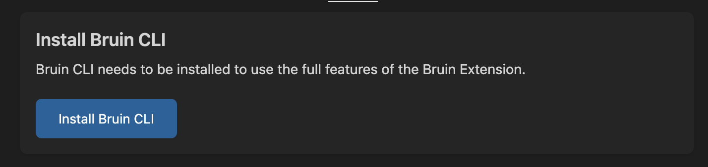

# Installation
Bruin has two high-level components that makes it work the best:
- a command-line interface (CLI) application: [Bruin CLI](https://github.com/bruin-data/bruin)
- a Visual Studio Code extension: [VS Code Extension](https://marketplace.visualstudio.com/items?itemName=bruin.bruin)

We recommend installing both of these components to make the most of the Bruin experience.

## Prerequisites
Bruin requires a few components to be installed:
- [Git](https://git-scm.com/downloads)
- [Visual Studio Code](https://code.visualstudio.com/download): optional, but highly recommended

In addition, there are some optional components:
- [Docker](https://docs.docker.com/engine/install/): optional, required if you'd like to ingest data
- [DuckDB](https://duckdb.org/docs/installation/): optional, useful for the tutorials in this documentation


## Bruin CLI

### MacOS
If you are on macOS, you can use `brew` to install Bruin:

```shell
brew install bruin-data/tap/bruin
```

### Windows, Linux and MacOS

If you are on macOS, linux or windows, you can use `curl` to install Bruin:

```shell
curl -LsSf https://raw.githubusercontent.com/bruin-data/bruin/refs/heads/main/install.sh | sh
```

Or you can also use `wget` to install Bruin:

```shell
wget -qO- https://raw.githubusercontent.com/bruin-data/bruin/refs/heads/main/install.sh | sh
```

> [!IMPORTANT]
> If you are on Windows, make sure to run the command in the Git Bash or WSL terminal.


## Bruin VSCode Extension

1. **Open Visual Studio Code**: Launch VS Code on your computer.
2. **Go to Extensions**: Click the Extensions icon in the Activity Bar.
3. **Search for "Bruin"**: type "Bruin" in the Extensions search bar.
4. **Install the Extension**: Click the Install button next to the Bruin extension in the results. You can also check the "Auto Update" option to ensure you don't miss out on new features and fixes.

   

5. **Check Bruin CLI Installation**:
    - When you click the **Bruin Launch** button, the extension checks if Bruin CLI is installed.
   - If the CLI is **not installed**, a message will appear in the **Settings** tab with a button to install it.
    


That's it, you are ready to roll with Bruin.


## Troubleshooting

### 'Permission Denied' error during the CLI installation

**Issue**  
When installing the Bruin CLI, you may encounter a `'Permission Denied'` error. This typically happens if the user doesn't have permission to write the binary to the `~/.local/bin` directory.

**Solution**  
To resolve this, ensure that you have the necessary write permissions for the `~/.local/bin` directory. You can do this by running the following command with sudo:

```shell
curl -LsSf https://raw.githubusercontent.com/bruin-data/bruin/refs/heads/main/install.sh | sudo sh
```
