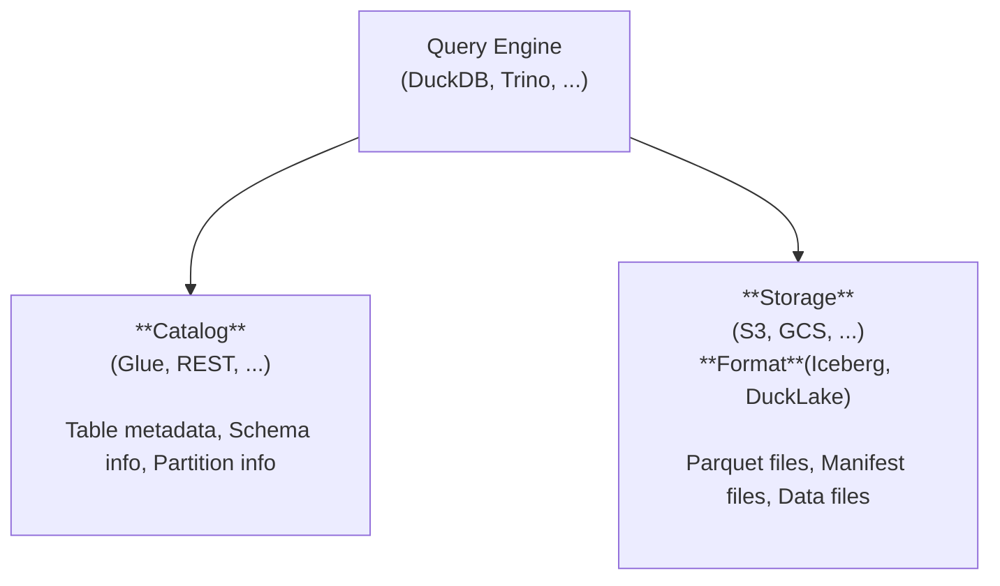

# Lakehouse Support <Badge type="warning" text="beta" />

> [!WARNING]
> Lakehouse support is currently in **beta**. APIs and configuration may change in future releases.

Bring lakehouse tables directly into your Bruin pipelines. Query Iceberg and DuckLake data on cloud object storage with a catalog-backed metadata layer, all from the same workflows you already use. This page summarizes supported engines, catalogs, and storage backends.

## Engines and formats

DuckDB and Trino (planned) are the engines bruin supports. In each section, you can discover the lakehouse format + catalog/storage combination supported by bruin. Visit [DuckDB](../platforms/duckdb.md#lakehouse-support) or [Trino](../platforms/trino.md#lakehouse-support) for bruin configurations.

### DuckDB [↗](../platforms/duckdb.md#lakehouse-support)

[Iceberg](https://duckdb.org/docs/extensions/iceberg) and [DuckLake](https://duckdb.org/docs/extensions/ducklake) format are supported and they run via DuckDB extensions. 

#### DuckLake

DuckLake uses a DuckDB or Postgres catalog. The table shows supported storage + catalog combinations. 
For more guidance, see DuckLake's [choosing a catalog database](https://ducklake.select/docs/stable/duckdb/usage/choosing_a_catalog_database).


| Catalog \ Storage | S3 |
|-------------------|----|
| DuckDB| <span class="lh-check" aria-label="supported"></span> |
| SQLite   |  |
| Postgres| <span class="lh-check" aria-label="supported"></span> |
| MySQL    |  |


#### Iceberg

Iceberg uses the AWS Glue Data Catalog ([AWS Glue Data Catalog](https://docs.aws.amazon.com/glue/latest/dg/aws-glue-data-catalog.html)). The table shows supported storage + catalog combinations.

| Catalog \ Storage | S3 |
|-------------------|----|
| Glue | <span class="lh-check" aria-label="supported"></span> |


### Trino (Planned)  [↗](../platforms/trino.md#lakehouse-support)

Trino support is planned via the [Iceberg connector](https://trino.io/docs/current/connector/iceberg.html) with Glue and [Nessie](https://projectnessie.org/) catalogs. Check out [Trino](../platforms/trino.md#lakehouse-support-planned). for bruin configuration. The table lists planned storage + catalog combinations.

| Catalog \ Storage | S3 |
|-------------------|----|
| Glue | Planned |
| Nessie | Planned |

## What is a Lakehouse?

A lakehouse combines the scalability of data lakes with the reliability of data warehouses. Data is stored in open formats on object storage (S3, GCS, Azure Blob) while metadata catalogs track schema, partitions, and table history.

<!-- Architecture -->



## Quick Start

Let's add a DuckLake lakehouse configuration to your DuckDB connection (DuckDB catalog + S3 storage):

```yaml
connections:
  duckdb:
    - name: "analytics"
      path: "./path/to/duckdb.db"
      lakehouse:
        format: ducklake
        catalog:
          type: duckdb
          path: "metadata.ducklake"
        storage:
          type: s3
          path: "s3://my-ducklake-warehouse/path"
          region: "us-east-1"
          auth:
            access_key: "AKIA..."
            secret_key: "..."
```

Then query your Iceberg tables (defaults to the `main` schema):

```bruin-sql
/* @bruin
name: lakehouse_users
type: duckdb.sql
connection: analytics
@bruin */


SELECT * FROM users;
```

See the engine-specific pages [DuckDB](../platforms/duckdb.md#lakehouse-support) or [Trino](../platforms/trino.md#lakehouse-support-planned) for detailed configuration options.
