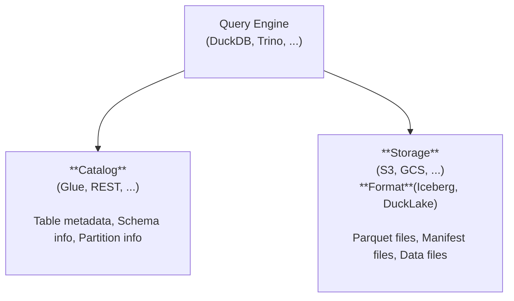

# Lakehouse Support <Badge type="warning" text="beta" />

> [!WARNING]
> Lakehouse support is currently in **beta**. APIs and configuration may change in future releases.

Bruin supports querying open table formats (Iceberg, DuckLake) stored in cloud object storage. Engine-specific configuration lives in the Data Platforms pages:


### DuckDB

See the DuckDB lakehouse configuration: [DuckDB](../platforms/duckdb.md#lakehouse-support).

#### DuckLake

| Catalog \ Storage | S3 |
|-------------------|----|
| DuckDB |  |
| SQLite   |  |
| Postgres | <span class="lh-check" aria-label="supported"></span> |
| MySQL    |  |


#### Iceberg

| Catalog \ Storage | S3 |
|-------------------|----|
| Glue | <span class="lh-check" aria-label="supported"></span> |

### Trino (Planned)

See the Trino lakehouse section: [Trino](../platforms/trino.md#lakehouse-support-planned).

| Catalog \ Storage | S3 |
|-------------------|----|
| Glue | Planned |
| Nessie | Planned |

## What is a Lakehouse?

A lakehouse combines the scalability of data lakes with the reliability of data warehouses. Data is stored in open formats on object storage (S3, GCS, Azure Blob) while metadata catalogs track schema, partitions, and table history.

<!-- Architecture -->



## Quick Start

Let's add a lakehouse (Iceberg Format, Glue Catalog, S3 Storage) configuration to your DuckDB connection:

```yaml
connections:
  duckdb:
    - name: "analytics"
      path: "./path/to/duckdb.db"
      lakehouse:
        format: iceberg
        catalog:
          type: glue
          catalog_id: "123456789012"
          region: "us-east-1"
          auth:
            access_key: "AKIA..."
            secret_key: "..."
        storage:
          type: s3
          region: "us-east-1"
          auth:
            access_key: "AKIA..."
            secret_key: "..."
```

Then query your Iceberg tables (defaults to the `main` schema):

```bruin-sql
/* @bruin
name: lakehouse_users
type: duckdb.sql
connection: analytics
@bruin */


SELECT * FROM users;
```

See the engine-specific pages [DuckDB](../platforms/duckdb.md#lakehouse-support) or [Trino](../platforms/trino.md#lakehouse-support-planned) for detailed configuration options.

