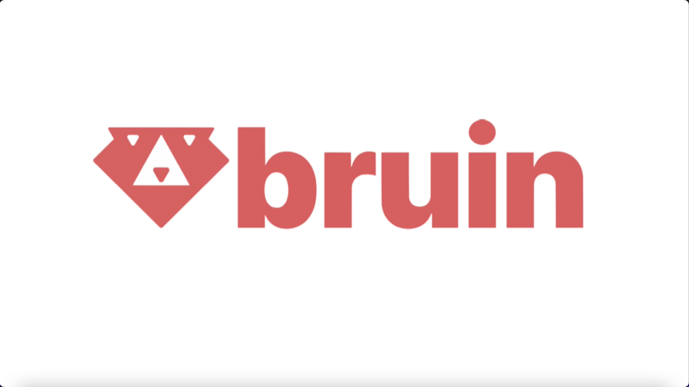

# Templates

We simplify the creation of pipelines through the use of **templates**. Templates provide a starting point with predefined structures, configurations, and connections to help you quickly set up and standardize your pipelines.

## What are templates?

Templates in Bruin are blueprints for initializing new pipelines. They:
- define the structure and essential files for a pipeline.
- contain boilerplate code and configurations tailored to specific use cases.
- allow users to quickly set up pipelines without starting from scratch.

By using templates, teams can focus on their pipeline logic rather than worrying about setup and configuration.

Watch the video below to see how to use templates in action:

