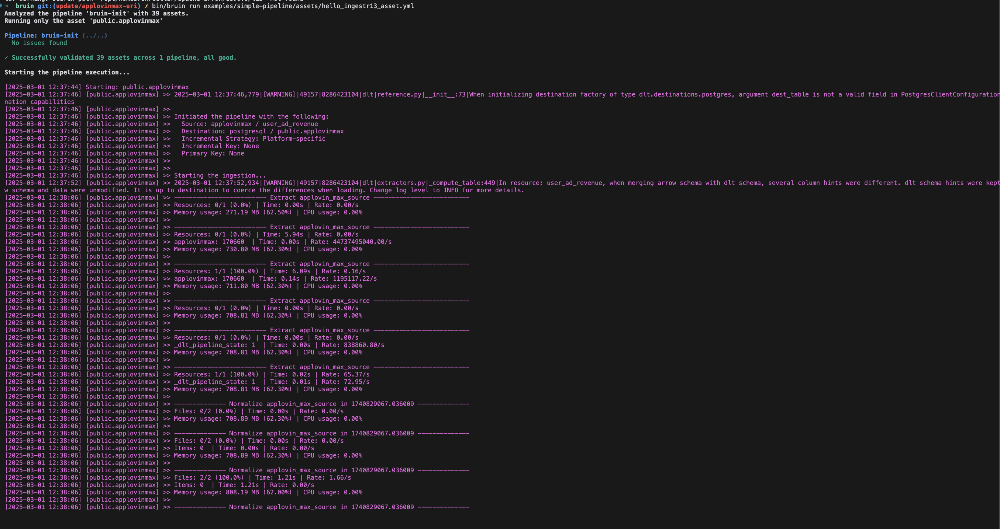

# Applovin Max
[AppLovin Max](https://www.applovin.com/max/) is a tool from AppLovin that helps app developers optimize ad revenue by selecting the highest-paying ads from various ad networks.

Bruin supports AppLovin Max as a source for [Ingestr assets](/assets/ingestr), and you can use it to ingest data from AppLovin Max into your data platform.

To set up a AppLovin Max connection, you must add a configuration item in the `.bruin.yml` and `asset` file. You need `api_key` that is report key and `application`. For details on how to obtain these credentials, please refer [here](https://developers.applovin.com/en/max/max-dashboard/account/account-info/#keys)

Follow the steps below to set up AppLovin Max correctly as a data source and run ingestion.
### Step 1: Add a connection to the .bruin.yml file
In order to set up AppLovin Max connection, you need to add a configuration item in the `.bruin.yml` file and `asset` file. This configuration must comply with the following schema:

```yaml
connections:
      applovinmax:
        - name: "my-applovinmax"
          api_key: "api_key_123"
```
- `api_key` (required): It is the `report key` which is used for authenticating the request.

### Step 2: Create an asset file for data ingestion
To ingest data from AppLovin Max, you need to create an [asset configuration](/assets/ingestr#asset-structure) file. This file defines the data flow from the source to the destination. Create a YAML file (e.g., applovinmax_ingestion.yml) inside the assets folder and add the following content:

```yaml
name: my.applovinmax
type: ingestr

parameters:
  source_connection: "my-applovinmax"
  source_table: 'user_ad_revenue:com.example.app1'

  destination: postgres
```

- `name`: The name of the asset.
- `type`: Specifies the asset’s type. Set this to `ingestr` to use the ingestr data pipeline. For AppLovin Max, it will be always `ingestr`.
- `source_connection`: The name of the AppLovin Max connection defined in `.bruin.yml`.
- `source_table`: The name of the table in AppLovin Max to ingest. Currently, we only support [user_ad_revenue](https://developers.applovin.com/en/max/reporting-apis/user-level-ad-revenue-api/). The format is `<table_name>:<application_ids>` where `application_ids` is a comma-separated list of application IDs.
- `destination`: The name of the destination connection.


### Step 3: [Run](/commands/run) asset to ingest data
```     
bruin run assets/applovinmax_asset.yml
```
As a result of this command, Bruin will ingest data from the given AppLovin Max table into your Postgres database.





