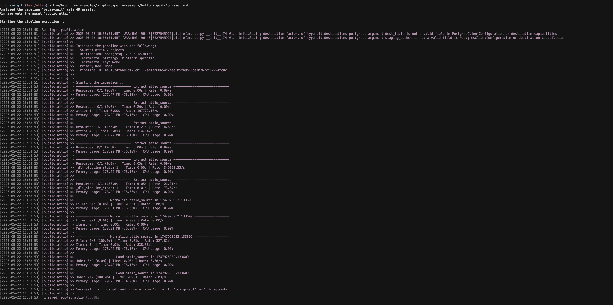

# Attio
[Attio](https://attio.com/) is an AI-native CRM platform that helps companies build, scale, and grow their business.

Bruin supports Attio as a source for [Ingestr assets](/assets/ingestr), and you can use it to ingest data from Attio into your data warehouse.

In order to set up Attio connection, you need to add a configuration item in the `.bruin.yml` file and in `asset` file.

Follow the steps below to correctly set up Attio as a data source and run ingestion.

### Step 1: Add a connection to .bruin.yml file
To connect to Attio, you need to add a configuration item to the connections section of the `.bruin.yml` file. This configuration must comply with the following schema:

```yaml
  Attio:
    - name: "attio"
      api_key: "key_123"
```
- `api_key`: the API key used for authentication with the Attio API

### Step 2: Create an asset file for data ingestion
To ingest data from Attio, you need to create an [asset configuration](/assets/ingestr#asset-structure) file. This file defines the data flow from the source to the destination. Create a YAML file (e.g., Attio_ingestion.yml) inside the assets folder and add the following content:

```yaml
name: public.attio
type: ingestr
connection: postgres

parameters:
  source_connection: attio
  source_table: 'objects'

  destination: postgres
```

- `name`: The name of the asset.
- `type`: Specifies the type of the asset. Set this to ingestr to use the ingestr data pipeline.
- `connection`: This is the destination connection, which defines where the data should be stored. For example: `postgres` indicates that the ingested data will be stored in a Postgres database.
- `source_connection`: The name of the Attio connection defined in .bruin.yml.
- `source_table`: The name of the data table in Attio that you want to ingest.

## Available Source Tables

| Table | PK | Inc Key | Inc Strategy | Details |
| ----- | -- | ------- | ------------ | ------- |
| `objects` | - | - | replace | Objects are the data types used to store facts about your customers. Fetches all objects. Full reload on each run. |
| `records:{object_api_slug}` | - | - | replace | Fetches all records of an object. For example: records:companies. Full reload on each run. |
| `lists` | - | - | replace | Fetches all lists. Full reload on each run. |
| `list_entries:{list_id}` | - | - | replace | Lists all items in a specific list. For example: list_entries:8abc-123-456-789d-123. Full reload on each run. |
| `all_list_entries:{object_api_slug}` | - | - | replace | Fetches all the lists for an object, and then fetches all the entries from that list. For example: all_list_entries:companies. Full reload on each run. |

### Step 3: [Run](/commands/run) asset to ingest data
```     
bruin run assets/attio_ingestion.yml
```
As a result of this command, Bruin will ingest data from the given Attio table into your Postgres database.



