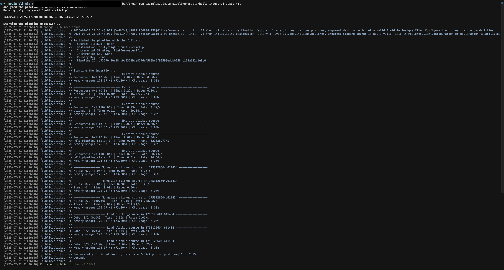

# ClickUp
[ClickUp](https://clickup.com/) is a cloud-based productivity platform designed to help teams and individuals manage tasks, projects, and workflows in one place.

Bruin supports ClickUp as a source for [Ingestr assets](/assets/ingestr). You can ingest data from ClickUp into your data platform.

To set up a ClickUp connection, add a configuration item in the `.bruin.yml` file and in your asset file. The configuration requires `api_token`.

### Step 1: Add a connection to the .bruin.yml file
```yaml
connections:
  clickup:
    - name: "clickup"
      api_token: "token_123"
```
- `api_token`: personal token used to authenticate with the ClickUp API.

### Step 2: Create an asset file for data ingestion
Create an [asset configuration](/assets/ingestr#asset-structure) file (e.g., `clickup_ingestion.yml`) inside the assets folder with the following content:
```yaml
name: public.clickup
type: ingestr

parameters:
  source_connection: clickup
  source_table: 'tasks'

  destination: postgres
```
- `name`: The name of the asset.
- `type`: Always `ingestr` for ClickUp.
- `source_connection`: The ClickUp connection name defined in `.bruin.yml`.
- `source_table`: Name of the ClickUp table to ingest.
- `destination`: The destination connection name.

## Available Source Tables

- `user`: The authorised user profile.
- `teams`: Workspaces available to the authenticated user.
- `spaces`: Spaces available within a workspace.
- `lists`: Lists contained in each space.
- `tasks`: Tasks belonging to each list.

### Step 3: [Run](/commands/run) asset to ingest data
```
bruin run assets/clickup_ingestion.yml
```
Running this command ingests data from ClickUp into your Postgres database.

