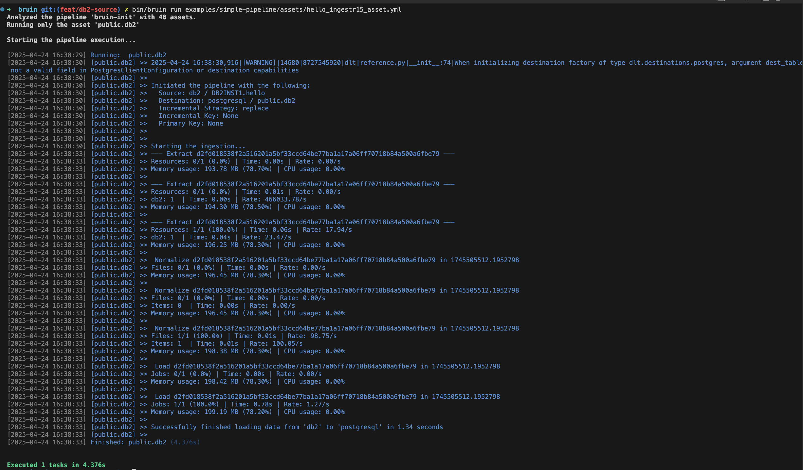

# IBM Db2
[IBM Db2](https://www.ibm.com/db2) is a high-performance, enterprise-grade relational database system designed for reliability, scalability, and transactional integrity.


Bruin supports DB2 as a source for [Ingestr assets](/assets/ingestr), and you can use it to ingest data from DB2 into your data warehouse.

In order to set up DB2 connection, you need to add a configuration item in the `.bruin.yml` file and in `asset` file.

Follow the steps below to correctly set up DB2 as a data source and run ingestion.

### Step 1: Add a connection to .bruin.yml file
To connect to DB2, you need to add a configuration item to the connections section of the `.bruin.yml` file. This configuration must comply with the following schema:

```yaml
  db2:
    - name: "db2"
      username: "user_123"
      password: "pass_123"
      host: "localhost"
      port: 50000
      database: "testdb"
```
- `username`: The username to connect to the database
- `password`: The password for the user
- `host`: The host address of the database server
- `port`: The port number the database server is listening
- `database`: the name of the database to connect to

### Step 2: Create an asset file for data ingestion
To ingest data from DB2, you need to create an [asset configuration](/assets/ingestr#asset-structure) file. This file defines the data flow from the source to the destination. Create a YAML file (e.g., db2_ingestion.yml) inside the assets folder and add the following content:

```yaml
name: public.db1
type: ingestr
connection: neon

parameters:
  source_connection: db2
  source_table: 'test.user'

  destination: postgres
```

- `name`: The name of the asset.
- `type`: Specifies the type of the asset. Set this to ingestr to use the ingestr data pipeline.
- `connection`: This is the destination connection, which defines where the data should be stored. For example: `postgres` indicates that the ingested data will be stored in a Postgres database.
- `source_connection`: The name of the DB2 connection defined in .bruin.yml.
- `source_table`: The name of the data table in DB2 that you want to ingest.

### Step 3: [Run](/commands/run) asset to ingest data
```     
bruin run assets/db2_ingestion.yml
```
As a result of this command, Bruin will ingest data from the given DB2 table into your Postgres database.


