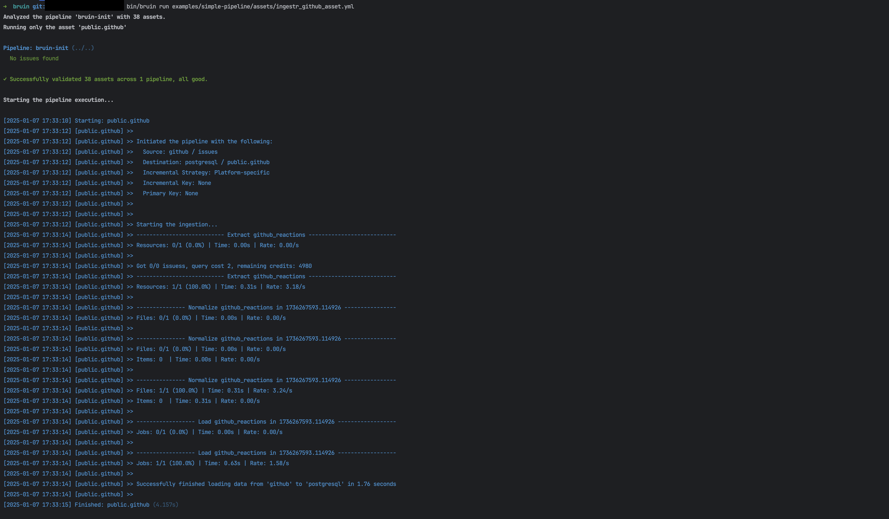

# GitHub
GitHub is a developer platform that allows developers to create, store, manage and share their code.

Bruin supports GitHub as a source for [Ingestr assets](/assets/ingestr), and you can use it to ingest data from GitHub into your data platform.

In order to set up GitHub connection, you need to add a configuration item in the `.bruin.yml` file and `asset` file. If you want to fetch from private repositories, you need to provide `access_token`, `owner` and `repo`.For details on how to obtain these credentials and to grant necessary permissions, please refer [here](https://dlthub.com/docs/dlt-ecosystem/verified-sources/github#setup-guide). If you want to fetch from public repositories, you only need to provide `owner` and `repo`.

Follow the steps below to correctly set up GitHub as a data source and run ingestion.

### Step 1: Add a connection to .bruin.yml file
To connect to GitHub as a source, you need to add a configuration item to the connections section of the `.bruin.yml` file. This configuration must comply with the following schema:

```yaml
connections:
  github:
    - name: my-github
      access_token: "token_123"
      owner: "John"
      repo: "repo_123"
```
- `access_token` (optional): Used for authentication to access data through the GitHub API for private repositories. 
- `owner` (required): The owner of the repository.
- `repo` (required): The name of the repository.

### Step 2: Create an asset file for data ingestion
To ingest data from GitHub, you need to create an [asset configuration](/assets/ingestr#asset-structure) file. This file defines the data flow from the source to the destination. Create a YAML file (e.g., github_ingestion.yml) inside the assets folder and add the following content:

```yaml
name: public.github
type: ingestr
connection: postgres

parameters:
  source_connection: my-github
  source_table: 'issues'

  destination: postgres
```

- `name`: The name of the asset.
- `type`: Specifies the type of the asset. Set this to ingestr to use the ingestr data pipeline.
- `connection`: This is the destination connection, which defines where the data should be stored. For example: `postgres` indicates that the ingested data will be stored in a Postgres database.
- `source_connection`: The name of the GitHub connection defined in .bruin.yml.
- `source_table`: The name of the table in GitHub you want to ingest. You can find the available source tables in GitHub [here](https://bruin-data.github.io/ingestr/supported-sources/github.html#tables).


### Step 3: [Run](/commands/run) asset to ingest data
```     
bruin run assets/github_ingestion.yml
```
As a result of this command, Bruin will ingest data from the given GitHub table into your Postgres database.





