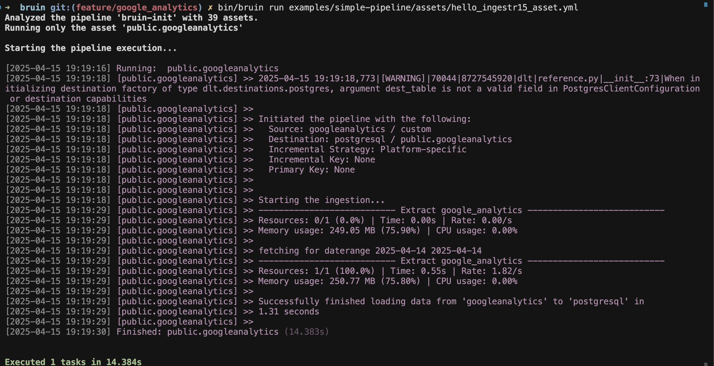

# Google Analyticss
[Google Analytics](https://marketingplatform.google.com/about/analytics/) is an analytics service that helps you measure traffic and engagement across various platforms, like websites and apps.

ingestr supports Google Analytics as a source.

Bruin supports Google Analytics as a source for [ingestr assets](/assets/ingestr), and you can use it to ingest data from Google Analytics into your data warehouse.

To set up a Google Analytics connection, you need to add a configuration item in the `.bruin.yml` file and the `asset` file. You will need path to `service_account_file` and `property_id`.

Follow the steps below to correctly set up Google Analytics as a data source and run ingestion.

### Step 1: Add a connection to .bruin.yml file
```yaml
    googleanalytics:
        - name: "googleanalytics"
          service_account_file: "/path/to/service/account.json"
          property_id: "1234"
```
- `service_account_file`: The path to the service account JSON file
- `property_id`: It is a unique number that identifies a particular property on Google Analytics. Follow this guide to know about [property ID](https://developers.google.com/analytics/devguides/reporting/data/v1/property-id#what_is_my_property_id).

### Step 2: Create an asset file for data ingestion
To ingest data from Google Analytics, you need to create an [asset configuration](/assets/ingestr#asset-structure) file. This file defines the data flow from the source to the destination. Create a YAML file (e.g., gAnalytics_ingestion.yml) inside the assets folder and add the following content:
s
```yaml
name: public.googleanalyticss
type: ingestr
connection: postgres

parameters:
  source_connection: googleanalytics
  source_table: 'custom:city,date:activeUsers,newUsers'

  destination: postgres
```
- `name`: The name of the asset.
- `type`: Specifies the asset’s type. Set this to `ingestr` to use the ingestr data pipeline. For Pipedrive, it will be always `ingestr`.
- `connection`: This is the destination connection, which defines where the data should be stored. For example: `postgres` indicates that the ingested data will be stored in a Postgres database.
- `source_connection`: The name of the Google Analytics connection defined in .bruin.yml.
- `source_table`: The name of the data table in Google Analytics to ingest data from.
Currently, only one table is supported: custom, which refers to Custom Reports. These allow you to retrieve data based on specific dimensions and metrics.
For more information, please visit [here](https://github.com/bruin-data/ingestr/blob/main/docs/supported-sources/google_analytics)
- `destination`: The name of the destination connection.

### Step 3: [Run](/commands/run) asset to ingest data
```     
bruin run assets/gAnalytics_ingestion.yml
```
As a result of this command, Bruin will ingest data from the given Google Analytics table into your Postgres database.


