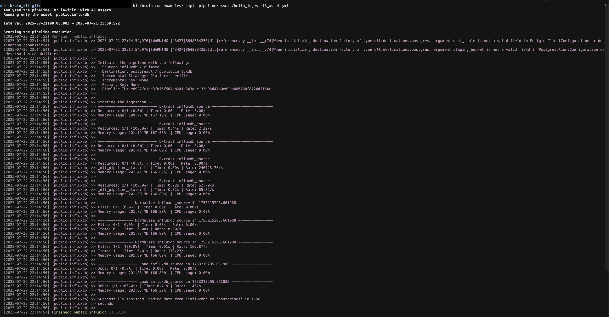

# InfluxDB
[InfluxDB](https://www.influxdata.com/) is a time series database optimized for storing high throughput metrics.

Bruin supports InfluxDB as a source for [Ingestr assets](/assets/ingestr). You can ingest data from InfluxDB into your data platform.

To set up a InfluxDB connection, add a configuration item in the `.bruin.yml` file and in your asset file. The configuration requires `host`, `org`, `token`, `bucket` and optionally `port` and `secure`.

Follow these steps to set up InfluxDB and run ingestion.

### Step 1: Add a connection to the .bruin.yml file
```yaml
connections:
  influxdb:
    - name: influxdb
      host: eu-central-76.aws.cloud2.influxdata.com
      token: token_1
      org: my-org
      bucket: my-ingestr-bucket
```
- `host`: The host address of the database server.
- `port`: The port number the database server is listening on. If you do not specify a port, the default is 8086 for self-hosted InfluxDB and 443 for InfluxDB Cloud.
- `token`: Authentication token.
- `org`: Name of the organization.
- `bucket`: Bucket that stores the measurements.
- `secure`: Optional. Use HTTPS when true (default) or HTTP when false.


### Step 2: Create an asset file for data ingestion
Create an [asset configuration](/assets/ingestr#asset-structure) file (e.g., `influxDB_ingestion.yml`) inside the assets folder with the following content:
```yaml
name: public.influxdb
type: ingestr
connection: neon

parameters:
  source_connection: influxdb
  source_table: 'climate'

  destination: postgres
```
- `name`: The name of the asset.
- `type`: Always `ingestr` for InfluxDB.
- `source_connection`: The InfluxDB connection name defined in `.bruin.yml`.
- `source_table`: Name of the InfluxDB table to ingest. The measurement name should be provided as the value for --source-table.
- `destination`: The destination connection name.

### Step 3: [Run](/commands/run) asset to ingest data
```
bruin run assets/influxDB_ingestion.yml
```
Running this command ingests data from InfluxDB into your Postgres database.


