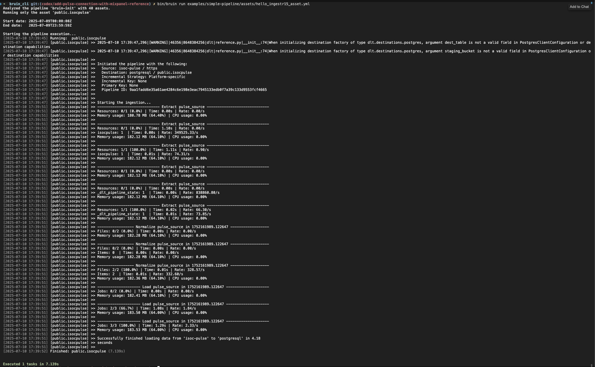

# Internet Society Pulse

[Internet Society Pulse](https://pulse.internetsociety.org/) is a platform that monitors the health, availability, and evolution of the Internet, providing metrics on key technologies that contribute to its security, resilience, and trustworthiness.

Bruin supports Internet Society Pulse as a source for [Ingestr assets](/assets/ingestr), allowing you to ingest data from Pulse into your data warehouse.

## Step 1: Add a connection to .bruin.yml file

To connect to Internet Society Pulse, add a configuration item to the `connections` section of your `.bruin.yml` file. You will need an API token from the Internet Society Pulse platform.

```yaml
connections:
  isoc_pulse:
    - name: 'my-pulse'
      token: 'your_token_here'
```
- `token`: The API token used for authentication with the Internet Society Pulse API.

## Step 2: Create an asset file for data ingestion

Create an [asset configuration](/assets/ingestr#asset-structure) YAML file (e.g., `pulse_ingestion.asset.yml`) in your assets folder:

```yaml
name: public.https_adoption_us
type: ingestr
connection: postgres

parameters:
  source_connection: my-pulse
  source_table: 'https:US'
  destination: postgres
```
- `name`: The name of the asset.
- `type`: Set to `ingestr` to use the ingestr data pipeline.
- `connection`: The destination connection (e.g., `postgres`).
- `source_connection`: The name of the Pulse connection defined in `.bruin.yml`.
- `source_table`: The metric to ingest. You can find the available source tables [here](https://bruin-data.github.io/ingestr/supported-sources/isoc-pulse.html#tables).

## Step 3: [Run](/commands/run) asset to ingest data

```
bruin run assets/pulse_ingestion.asset.yml
```
This command will ingest data from the specified Internet Society Pulse metrics into your destination database.





