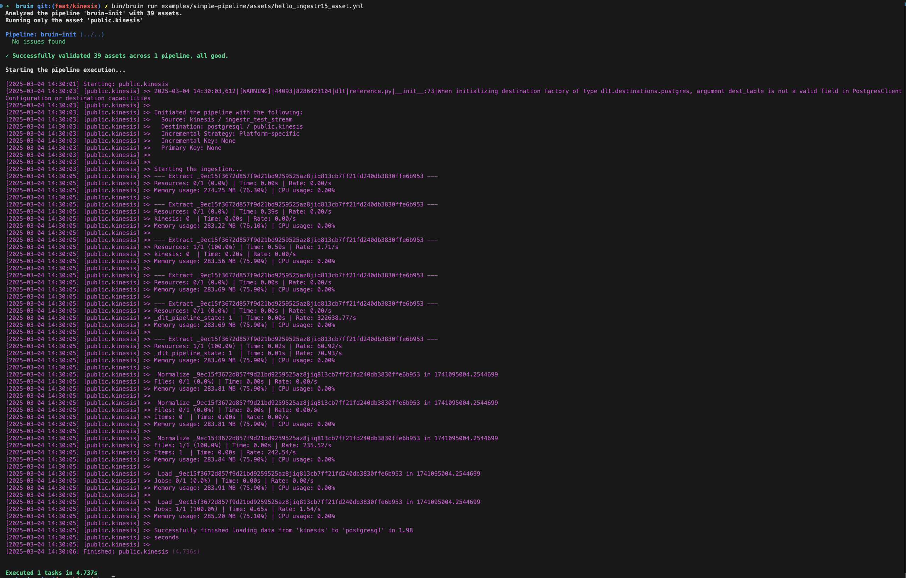

# Amazon Kinesis
[Amazon Kinesis](https://aws.amazon.com/kinesis/) is a cloud-based service for real-time data streaming and analytics, enabling the processing and analysis of large streams of data in real time.

Bruin supports Kinesis as a source for [Ingestr assets](/assets/ingestr), and you can use it to ingest data from Kinesis into your data warehouse.

To set up a Kinesis connection, you need to have `aws_access_key_id`, `aws_secret_access_key` and `region`. For more information, please refer [here](https://dlthub.com/docs/dlt-ecosystem/verified-sources/amazon_kinesis#grab-credentials)

Follow the steps below to correctly set up Kinesis as a data source and run ingestion:

### Step 1: Add a connection to .bruin.yml file

To connect to Kinesis, you need to add a configuration item to the connections section of the `.bruin.yml` file. This configuration must comply with the following schema:

```yaml
    connections:
      kinesis:
        - name: "kinesis"
          access_key_id: "access_key_id_123"
          secret_access_key: "secret_access_key_123"
          region: "eu-central-1"
```
- `access_key_id`: The access key ID used for authentication with the Kinesis API.
- `secret_access_key`: The secret access key used for authentication with the Kinesis API.
- `region`: The AWS region name where the stream is located.

### Step 2: Create an asset file for data ingestion

To ingest data from Kinesis, you need to create an [asset configuration](/assets/ingestr#asset-structure) file. This file defines the data flow from the source to the destination. Create a YAML file (e.g., kinesis_ingestion.yml) inside the assets folder and add the following content:

```yaml
name: public.kinesis
type: ingestr
connection: postgres

parameters:
  source_connection: kinesis
  source_table: 'test_stream'

  destination: postgres
```

- `name`: The name of the asset.
- `type`: Specifies the type of the asset. It will be always `ingestr` type for Kinesis.
- `connection`: This is the destination connection. 
- `source_connection`: The name of the Kinesis connection defined in .bruin.yml.
- `source_table`: Specify the `stream name` you want to read from. For example, if you want to read from a Kinesis stream named "customer_events", you would use source_table as customer_events.


### Step 3: [Run](/commands/run) asset to ingest data
```
bruin run ingestr.kinesis.asset.yml
```
As a result of this command, Bruin will ingest data from the given Kinesis table into your Postgres database.

