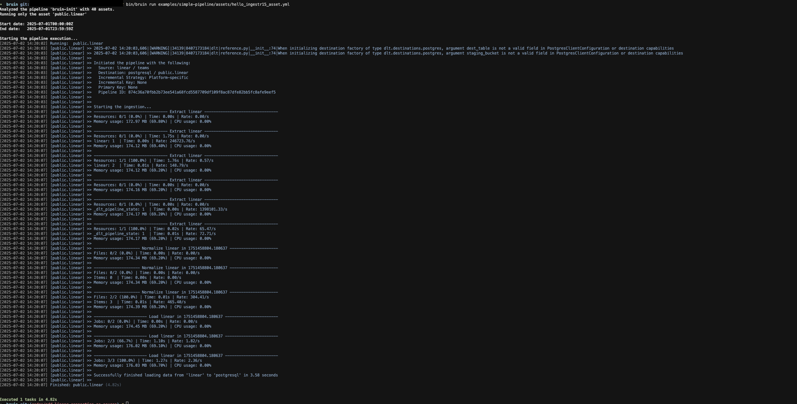

# Linear
[Linear](https://linear.app/) is a project management platform for software teams.

Bruin supports Linear as a source for [Ingestr assets](/assets/ingestr). You can ingest data from Linear into your data platform.

To set up a Linear connection, add a configuration item in the `.bruin.yml` file and in your asset file. The configuration requires `api_key`.

### Step 1: Add a connection to the .bruin.yml file
```yaml
connections:
  linear:
    - name: "linear"
      api_key: "lin_api_123"
```
- `api_key`: Linear API key.

### Step 2: Create an asset file for data ingestion
Create an [asset configuration](/assets/ingestr#asset-structure) file (e.g., `linear_ingestion.yml`) inside the assets folder with the following content:
```yaml
name: public.linear
type: ingestr

parameters:
  source_connection: linear
  source_table: 'teams'

  destination: postgres
```
- `name`: The name of the asset.
- `type`: Always `ingestr` for Linear.
- `source_connection`: The Linear connection name defined in `.bruin.yml`.
- `source_table`: Name of the Linear table to ingest (`issues`, `projects`, `teams`, or `users`).
- `destination`: The destination connection name.

### Step 3: [Run](/commands/run) asset to ingest data
```
bruin run assets/linear_ingestion.yml
```
Running this command ingests data from Linear into your Postgres database.


