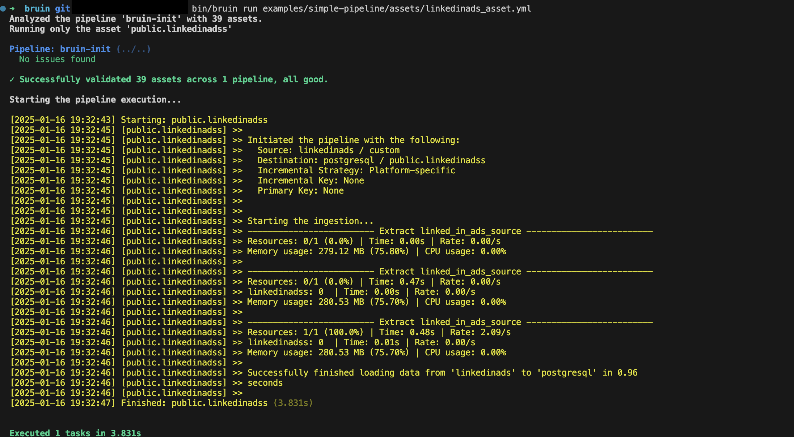

# LinkedIn Ads
LinkedIn Ads is an advertising platform that allows businesses and marketers to create, manage, and analyze advertising campaigns.

Bruin supports LinkedIn Ads as a source for [Ingestr assets](/assets/ingestr), and you can use it to ingest data from LinkedIn Ads into your data platform.

To set up a LinkedIn Ads connection, you must add a configuration item in the `.bruin.yml` and `asset` file. You need `access_token` and `account_ids`. For details on how to obtain these credentials, please refer [here](https://bruin-data.github.io/ingestr/supported-sources/linkedin_ads.html#create-a-linkedin-developer-application-to-obtain-an-access-token)

Follow the steps below to set up LinkedIn Ads correctly as a data source and run ingestion.
### Step 1: Add a connection to the .bruin.yml file
In order to set up LinkedIn Ads connection, you need to add a configuration item in the `.bruin.yml` file and `asset` file. This configuration must comply with the following schema:

```yaml
connections:
      linkedinads:
        - name: "my-linkedinads"
          account_ids: "id_123,id_456"
          access_token: "token_123"
```
- `access_token` (required): The access token is used for authentication and allows your app to access data based on the permissions configured in the Developer App for your LinkedIn account.
- `account_ids` (required): A comma-separated list of LinkedIn Ad Account IDs that identifies the accounts from which you want to retrieve data. 

### Step 2: Create an asset file for data ingestion
To ingest data from LinkedIn Ads, you need to create an [asset configuration](/assets/ingestr#asset-structure) file. This file defines the data flow from the source to the destination. Create a YAML file (e.g., linkedinads_ingestion.yml) inside the assets folder and add the following content:

```yaml
name: public.linkedinads
type: ingestr
connection: postgres

parameters:
  source_connection: my-linkedinads
  source_table: 'custom:campaign,month:clicks,impressions,shares'

  destination: postgres
```

- `name`: The name of the asset.
- `type`: Specifies the asset’s type. Set this to `ingestr` to use the ingestr data pipeline.
- `connection`: The name of the destination connection and it must match the name of the connection defined in the .`bruin.yml` file.
- `source_connection`: The name of the LinkedIn Ads connection defined in `.bruin.yml`.
- `source_table`: The name of the table in LinkedIn Ads to ingest. Currently, we only support custom reports based on specified dimensions and metrics.

Custom Table Format:
`custom:<dimensions>:<metrics>`

Parameters:
- `dimensions`(required): A comma-separated list of dimensions to retrieve. It must include at least one of the following: `campaign`, `account`, or `creative`, along with one time-based dimension, either `date` or `month`.

- `metrics`(required): A comma-separated list of [metrics](https://learn.microsoft.com/en-us/linkedin/marketing/integrations/ads-reporting/ads-reporting?view=li-lms-2024-11&tabs=http#metrics-available) to retrieve.

### Step 3: [Run](/commands/run) asset to ingest data
```     
bruin run assets/linkedinads_asset.yml
```
As a result of this command, Bruin will ingest data from the given LinkedIn Ads table into your Postgres database.





