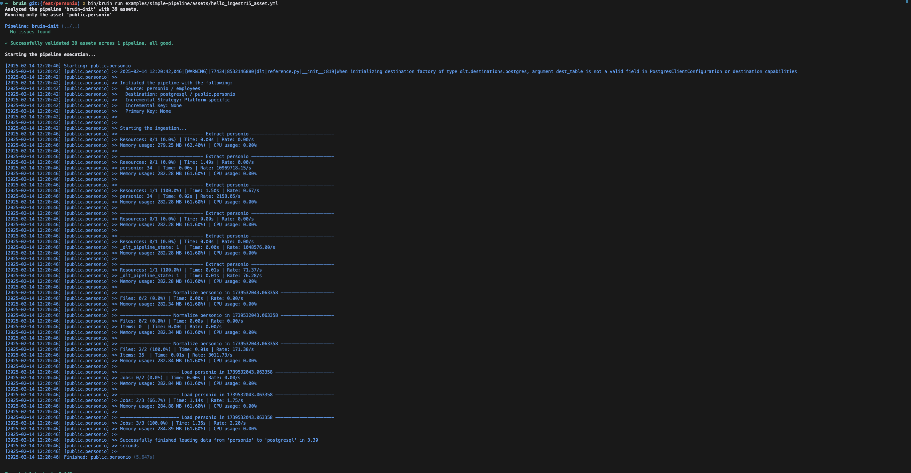

# Personio
[Personio](https://personio.de/) is a human resources management software that helps businesses
streamline HR processes, including recruitment, employee data management, and payroll, in one
platform.

Bruin supports Personio as a source for [Ingestr assets](/assets/ingestr), and you can use it to ingest data from Personio into your data platform.

To set up a Personio connection, you must add a configuration item in the `.bruin.yml` and `asset` file. You need `client_id` and `client_secret`. For details on how to obtain these credentials, please refer [here](https://dlthub.com/docs/dlt-ecosystem/verified-sources/personio#grab-credentials)

Follow the steps below to set up Personio correctly as a data source and run ingestion.
### Step 1: Add a connection to the .bruin.yml file
In order to set up Personio connection, you need to add a configuration item in the `.bruin.yml` file and `asset` file. This configuration must comply with the following schema:

```yaml
connections:
      personio:
        - name: "personio"
          client_id: "id_123"
          client_secret: "secret_123"    
```
- `client_id` (required): It is the `client_id` which is used for authenticating the request.
- `client_secret` (required): It is the `client_secret` which is used for authenticating the request.

### Step 2: Create an asset file for data ingestion
To ingest data from Personio, you need to create an [asset configuration](/assets/ingestr#asset-structure) file. This file defines the data flow from the source to the destination. Create a YAML file (e.g., personio_ingestion.yml) inside the assets folder and add the following content:

```yaml
name: public.personio
type: ingestr

parameters:
  source_connection: personio
  source_table: 'employees'

  destination: postgres
```

- `name`: The name of the asset.
- `type`: Specifies the asset’s type. Set this to `ingestr` to use the ingestr data pipeline. For Personio, it will be always `ingestr`.
- `source_connection`: The name of the Personio connection defined in `.bruin.yml`.
- `source_table`: The name of the table in Personio to ingest. Available tables are:
  - `employees` : Retrieves company employees details
  - `absences` : Retrieves absence periods for absences tracked in days
  - `absence_types` : Retrieves list of various types of employee absences
  - `attendances` : Retrieves attendance records for each employee
  - `projects` : Retrieves a list of all company projects
  - `document_categories` : Retrieves all document categories of the company
  - `employees_absences_balance` : Retrieves the absence balance for a specific employee
  - `custom_reports_list` : Retrieves metadata about existing custom reports in your Personio account, such as report name, report type, report date / timeframe.
- `destination`: The name of the destination connection.


### Step 3: [Run](/commands/run) asset to ingest data
```     
bruin run assets/personio_asset.yml
```
As a result of this command, Bruin will ingest data from the given Personio table into your Postgres database.





