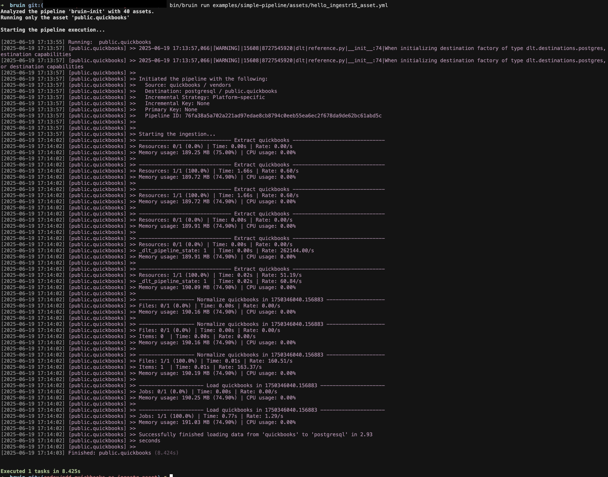

# QuickBooks
[QuickBooks](https://quickbooks.intuit.com/) is an accounting software package developed by Intuit.

Bruin supports QuickBooks as a source for [Ingestr assets](/assets/ingestr), so you can ingest data from QuickBooks into your data warehouse.

To connect to QuickBooks you must add a configuration item to the `.bruin.yml` file and the asset file. You will need `company_id`, `client_id`, `client_secret` and `refresh_token`.

Follow the steps below to correctly set up QuickBooks as a data source and run ingestion.

### Step 1: Add a connection to .bruin.yml file
Add the connection configuration to the connections section of `.bruin.yml`:

```yaml
connections:
  quickbooks:
    - name: "quickbooks"
      company_id: "123456"
      client_id: "cid"
      client_secret: "csecret"
      refresh_token: "rtoken"
```

### Step 2: Create an asset file for data ingestion
Create an [asset configuration](/assets/ingestr#asset-structure) file to define the data flow:

```yaml
name: public.quickbooks_customers
type: ingestr

parameters:
  source_connection: quickbooks
  source_table: 'customers'

  destination: postgres
```

- `source_connection`: name of the QuickBooks connection defined in `.bruin.yml`.
- `source_table`: QuickBooks table to ingest. Available tables are listed in the [Ingestr documentation](https://github.com/bruin-data/ingestr/blob/main/docs/supported-sources/quickbooks.md#tables).
- `destination`: name of the destination connection.

### Step 3: [Run](/commands/run) asset to ingest data
```
bruin run assets/quickbooks_asset.yml
```

Executing this command ingests data from QuickBooks into your Postgres database.


