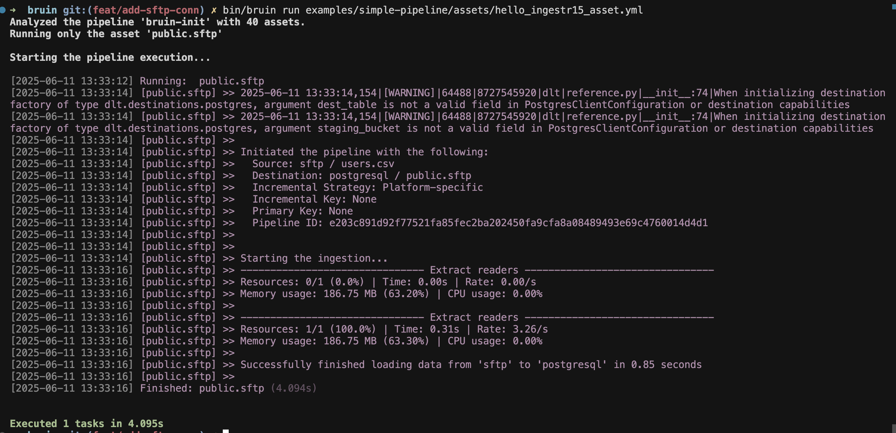

# sftp
SFTP (SSH File Transfer Protocol) is a secure file transfer protocol that runs over the SSH protocol. It provides a secure way to transfer files between a local and a remote computer.


Bruin supports sftp as a source for [Ingestr assets](/assets/ingestr), and you can use it to ingest data from sftp into your data warehouse.

In order to set up sftp connection, you need to add a configuration item in the `.bruin.yml` file and in `asset` file. You need `username`, `password`, `host`, `port` of sftp server.

Follow the steps below to correctly set up sftp as a data source and run ingestion.

### Step 1: Add a connection to .bruin.yml file

To connect to sftp, you need to add a configuration item to the connections section of the `.bruin.yml` file. This configuration must comply with the following schema:

```yaml
connections:
    sftp:
        - name: sftp
          username: user_1
          password: pass-1234
          host: localhost
          port: 22
```

- `username`: The username for the SFTP server.
- `password`: The password for the SFTP server.
- `host`: The hostname or IP address of the SFTP server.
- `port`: The port number of the SFTP server.

### Step 2: Create an asset file for data ingestion

To ingest data from sftp, you need to create an [asset configuration](/assets/ingestr#asset-structure) file. This file defines the data flow from the source to the destination. Create a YAML file (e.g., sftp_ingestion.yml) inside the assets folder and add the following content:

```yaml
name: public.sftp
type: ingestr
connection: neon

parameters:
  source_connection: sftp
  source_table: 'users.csv'

  destination: postgres
```

- `name`: The name of the asset.
- `type`: Specifies the type of the asset. Set this to ingestr to use the ingestr data pipeline.
- `connection`: This is the destination connection, which defines where the data should be stored. For example: "postgres" indicates that the ingested data will be stored in a PostgreSQL database.
- `source_connection`: The name of the sftp connection defined in .bruin.yml.
- `source_table`: The source-table specifies /path/to/directory. The base directory on the server where bruin should start looking for files.

### Step 3: [Run](/commands/run) asset to ingest data
```     
bruin run assets/sftp_ingestion.yml
```
As a result of this command, Bruin will ingest data from the given sftp table into your Postgres database.


