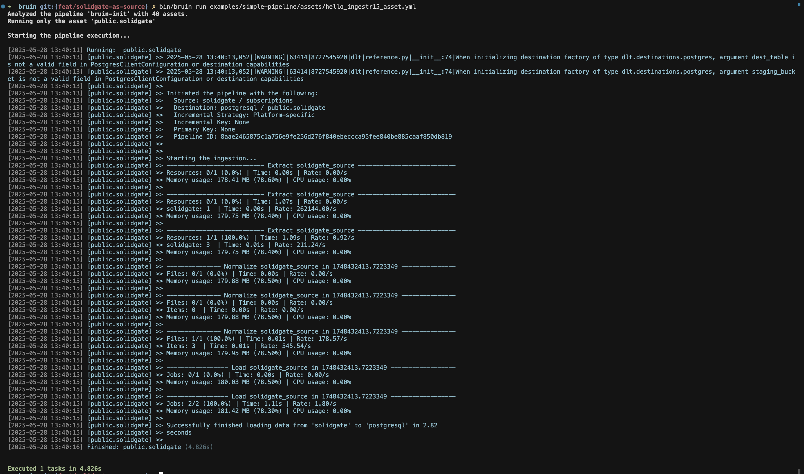

# Solidgate
[Solidgate](https://solidgate.com/) is a one-stop payment processing platform that ensures seamless online purchases and streamlined payment infrastructure.

ingestr supports Solidgate as a source.

Bruin supports Solidgate as a source for [Ingestr assets](/assets/ingestr), and you can use it to ingest data from Solidgate into your data warehouse.

In order to set up Solidgate connection, you need to add a configuration item in the `.bruin.yml` file and in `asset` file. You need `public_key` and `secret_key` . For details on how to obtain these credentials, please refer [here](https://docs.solidgate.com/payments/integrate/access-to-api/#retrieve-your-credentials).

Follow the steps below to correctly set up Solidgate as a data source and run ingestion.

### Step 1: Add a connection to .bruin.yml file

To connect to Solidgate, you need to add a configuration item to the connections section of the `.bruin.yml` file. This configuration must comply with the following schema:

```yaml
connections:
    solidgate:
        - name: "solidgate"
          secret_key: "api_sk_test"
          public_key: "api_pk_test"
```
- `public_key`: The public API key used to identify the account.
- `secret_key`: The secret API key used to authenticate requests to the Solidgate API.

### Step 2: Create an asset file for data ingestion

To ingest data from Solidgate, you need to create an [asset configuration](/assets/ingestr#asset-structure) file. This file defines the data flow from the source to the destination. Create a YAML file (e.g., solidgate_ingestion.yml) inside the assets folder and add the following content:

```yaml
name: public.solidgate
type: ingestr
connection: postgres

parameters:
  source_connection: solidgate
  source_table: 'subscriptions'

  destination: postgres
```

- `name`: The name of the asset.
- `type`: Specifies the type of the asset. Set this to ingestr to use the ingestr data pipeline.
- `connection`: This is the destination connection, which defines where the data should be stored. For example: "postgres" indicates that the ingested data will be stored in a PostgreSQL database.
- `source_connection`: The name of the Solidgate connection defined in .bruin.yml.
- `source_table`: The name of the data table in Solidgate you want to ingest.

## Available Source Tables

| Table | PK | Inc Key | Inc Strategy | Details |
|-------|----|---------|--------------| ------- |
| `subscriptions` | id | updated_at | merge | Provides a comprehensive view of customer subscriptions, including subscription IDs, statuses, and key timestamps such as creation, update, and expiration dates |
| `apm_orders` | order_id | updated_at | merge | Provides essential information for anti-fraud purposes, including order IDs, transaction statuses, amounts, currencies, and payment methods, along with crucial customer details such as email addresses |
| `card_orders` | order_id | updated_at | merge | Provides detailed information on orders processed via card payments, including transaction data, payment status, and customer details |
| `financial_entries` | id | created_at | merge | Provides a detailed transaction-level breakdown of financial records |

### Step 3: [Run](/commands/run) asset to ingest data
```     
bruin run assets/Solidgate_ingestion.yml
```
As a result of this command, Bruin will ingest data from the given Solidgate table into your Postgres database.



