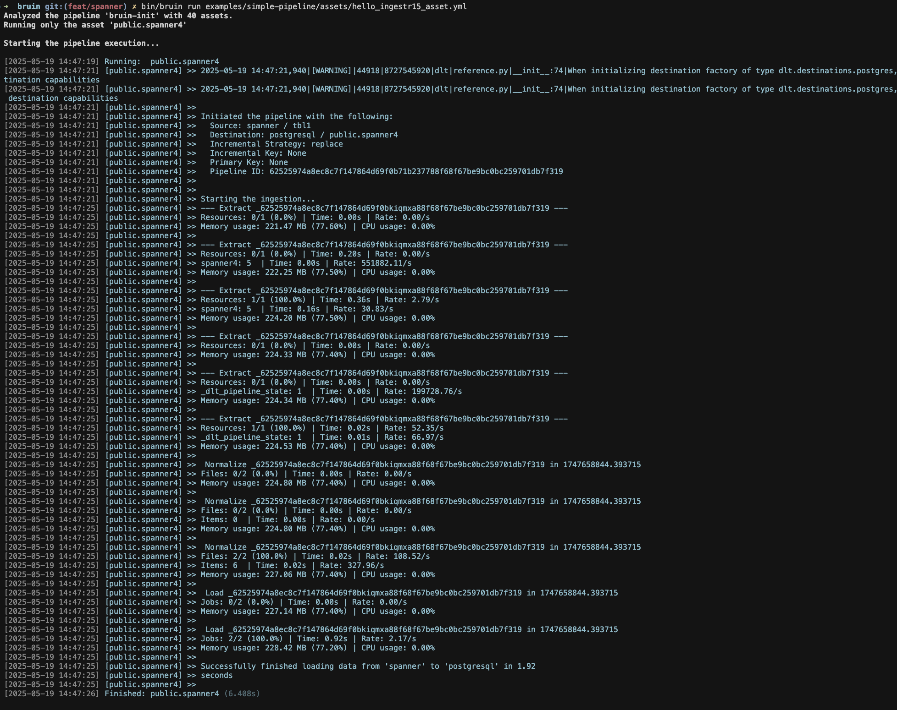

# Spanner
Spanner is a fully managed, mission-critical database service that combines the capabilities of relational databases, key-value stores, and search engines.

Bruin supports Spanner as a source for [Ingestr assets](/assets/ingestr), and you can use it to ingest data from Spanner into your data warehouse. 

In order to set up Spanner connection, you need to add a configuration item in the `.bruin.yml` file and in `asset` file.

Follow the steps below to correctly set up Spanner as a data source and run ingestion.

### Step 1: Add a connection to .bruin.yml file
To connect to Spanner, you need to add a configuration item to the connections section of the `.bruin.yml` file. This configuration must comply with the following schema:
```yaml
    connections:
      spanner:
        - name: "spanner"
          project_id: "project_123"
          instance_id: "instance_123"
          database: "my-db"
          credentials_path: "./service_account.json"
```
URI parameters:
- `project_id`: Your Google Cloud project ID
- `instance_id`: The Spanner instance ID
- `database`: The database name
- `credentials_path`: Path to your Google Cloud service account JSON file
- `credentials_base64`: Your Google Cloud service account credentials encoded as a Base64 string. This is an alternative to using `credentials_path` 

### Step 2: Create an asset file for data ingestion

To ingest data from Spanner, you need to create an [asset configuration](/assets/ingestr#asset-structure) file. This file defines the data flow from the source to the destination. Create a YAML file (e.g., spanner_ingestion.yml) inside the assets folder and add the following content:

```yaml
name: public.spanner
type: ingestr
connection: neon

parameters:
  source_connection: spanner
  source_table: 'tbl1'

  destination: postgres
```
- `name`: The name of the asset.
- `type`: Specifies the type of the asset. Set this to ingestr to use the ingestr data pipeline.
- `connection`: The name of the destination connection. For example, "neon" is a connection name.
- `source_connection`: The name of the Spanner connection defined in .bruin.yml.
- `source_table`: The name of the data table in Spanner that you want to ingest.
- `destination`: The name or type of the destination connection, which is Postgres.

### Step 3: [Run](/commands/run) asset to ingest data
```     
bruin run assets/spanner_ingestion.yml
```
As a result of this command, Bruin will ingest data from the given Spanner table into your Postgres database.



