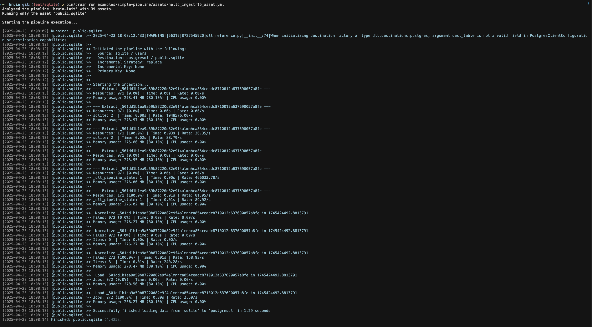

# SQLite
SQLite is a C-language library that implements a small, fast, self-contained, high-reliability, full-featured, SQL database engine.

ingestr supports SQLite as a source.

Bruin supports SQLite as a source for [Ingestr assets](/assets/ingestr), and you can use it to ingest data from SQLite into your data warehouse. 

In order to set up SQLite connection, you need to add a configuration item in the `.bruin.yml` file and in `asset` file.

Follow the steps below to correctly set up SQLite as a data source and run ingestion.

### Step 1: Add a connection to .bruin.yml file
To connect to SQLite, you need to add a configuration item to the connections section of the `.bruin.yml` file. This configuration must comply with the following schema:
```yaml
    connections:
      sqlite:
        - name: "sqlite"
          path: "/Users/test/temporary/my_database.db"
```
- `name`: The name to identify this SQLite connection
- `path`: The path to the SQLite database file


### Step 2: Create an asset file for data ingestion

To ingest data from SQLite, you need to create an [asset configuration](/assets/ingestr#asset-structure) file. This file defines the data flow from the source to the destination. Create a YAML file (e.g., sqlite_ingestion.yml) inside the assets folder and add the following content:

```yaml
name: public.sqlite
type: ingestr
connection: neon

parameters:
  source_connection: sqlite
  source_table: 'users'

  destination: postgres
```
- `name`: The name of the asset.
- `type`: Specifies the type of the asset. Set this to ingestr to use the ingestr data pipeline.
- `connection`: This is the destination connection, which defines where the data should be stored. For example: `postgres` indicates that the ingested data will be stored in a Postgres database.
- `source_connection`: The name of the SQLite connection defined in .bruin.yml.
- `source_table`: The name of the data table in SQLite that you want to ingest.
- `destination`: The name of the destination connection.

### Step 3: [Run](/commands/run) asset to ingest data
```     
bruin run assets/sqlite_ingestion.yml
```
As a result of this command, Bruin will ingest data from the given SQLite table into your Postgres database.


