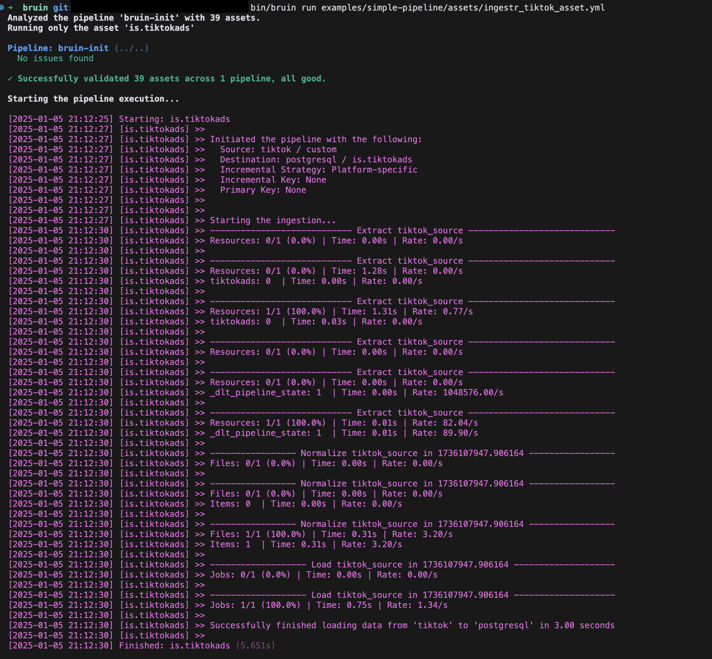

# TikTok Ads
TikTok Ads is an advertising platform that enables businesses and marketers to create, manage, and analyze ad campaigns targeting TikTok's user base.

Bruin supports TikTok Ads as a source for [Ingestr assets](/assets/ingestr), and you can use it to ingest data from TikTok Ads into your data warehouse.

In order to set up TikTok Ads connection, you need to add a configuration item in the `.bruin.yml` file and `asset` file. You need `access_token` and `advertiser_ids`. `timezone` is optional. For details on how to obtain these credentials, please refer [here](https://business-api.tiktok.com/portal/docs?id=1738373141733378)

Follow the steps below to correctly set up TikTok Ads as a data source and run ingestion.

### Step 1: Add a connection to .bruin.yml file
To connect to TikTok Ads as a source, you need to add a configuration item to the connections section of the `.bruin.yml` file. This configuration must comply with the following schema:

```yaml
connections:
  <destination_connection_details>
  tiktokads:
     - name: my-tiktokads
       access_token: "access_token123"
       advertiser_ids: "id_123,id_456"
       timezone: "Europe/Madrid"
```
- `access_token` (required): Used for authentication and is necessary to access reports through the TikTok Marketing API.
- `advertiser_ids` (required): The comma-separated list of advertiser IDs to retrieve data for.
- `timezone` (optional): The timezone to use for the data retrieval, you should set this value to the timezone of the advertiser account. Defaults to `UTC`.

### Step 2: Create an asset file for data ingestion
To ingest data from TikTok Ads, you need to create an [asset configuration](/assets/ingestr#asset-structure) file. This file defines the data flow from the source to the destination. Create a YAML file (e.g., tiktokads_ingestion.yml) inside the assets folder and add the following content:

```yaml
name: public.tiktokads
type: ingestr
connection: postgres

parameters:
  source_connection: my-tiktokads
  source_table: 'custom:campaign_id,stat_time_day:clicks,cpc'

  destination: postgres
```

- `name`: The name of the asset.
- `type`: Specifies the type of the asset. Set this to ingestr to use the ingestr data pipeline.
- `connection`: This is the destination connection, which defines where the data should be stored. For example: `postgres` indicates that the ingested data will be stored in a Postgres database.
- `source_connection`: The name of the  TikTok Ads connection defined in .bruin.yml.
- `source_table`: The custom report in TikTok Ads you want to ingest based on the dimension and metrics.
Custom Table Format:

`custom:<dimensions>:<metrics>[:<filter_name,filter_values>]`
Parameters:
`dimensions`(required): A comma-separated list of dimensions to retrieve.
`metrics(required): A comma-separated list of metrics to retrieve.
`filters (optional): Filters are specified in the format <filter_name=filter_values>.
`filter_name`: The name of the filter (e.g. campaign_ids).
`filter_values`: A comma-separated list of one or more values associated with the filter name (e.g., camp_id123,camp_id456). Only the IN filter type is supported. Learn more about filters [here](https://business-api.tiktok.com/portal/docs?id=1751443975608321).

### Step 3: [Run](/commands/run) asset to ingest data
```     
bruin run assets/tiktok_ads_ingestion.yml
```
As a result of this command, Bruin will ingest data from the given TikTok Ads table into your Postgres database.





