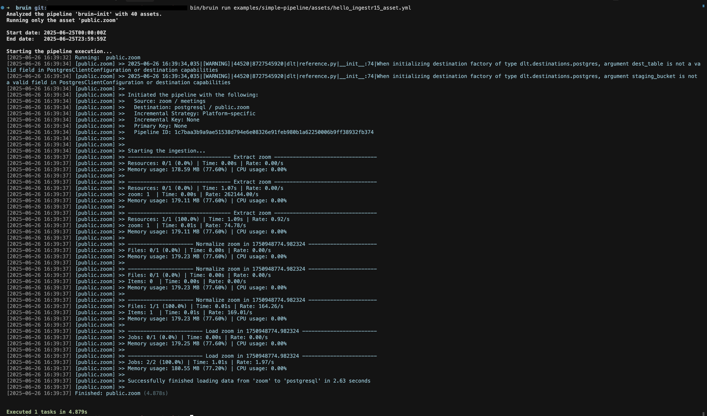

# Zoom
[Zoom](https://zoom.us/) is a video conferencing platform used for online meetings and webinars.

Bruin supports Zoom as a source for [ingestr assets](/assets/ingestr), so you can ingest data from Zoom into your data warehouse.

### Prerequisites
- A Zoom Server-to-Server OAuth App
- Appropriate permissions related to meetings and users must be added in the app's scopes
- Obtain the client_id, client_secret and account_id credentials from the app

To connect to Zoom you must add a configuration item to the `.bruin.yml` file and the asset file.
Follow the steps below to correctly set up Zoom as a data source and run ingestion.

### Step 1: Add a connection to .bruin.yml file
Add the connection configuration to the connections section of `.bruin.yml`:

```yaml
connections:
  zoom:
    - name: "zoom"
      client_id: "cid"
      client_secret: "csecret"
      account_id: "accid"
```

- `client_id`: OAuth client id from your Zoom application.
- `client_secret`: OAuth client secret.
- `account_id`: Zoom account id.

### Step 2: Create an asset file for data ingestion
Create an [asset configuration](/assets/ingestr#asset-structure) file to define the data flow:

```yaml
name: public.zoom_meetings
type: ingestr

parameters:
  source_connection: zoom
  source_table: 'meetings'

  destination: duckdb
```

- `source_connection`: name of the Zoom connection defined in `.bruin.yml`.
- `source_table`: Zoom table to ingest. Available tables:

Table    PK    Inc Key    Inc Strategy    Details
meetings    id    start_time    merge    Retrieve all valid previous meetings, live meetings, and upcoming scheduled meetings for all users in the given Zoom account. Permissions required: meeting:read:admin,meeting:read, Granular permissions, meeting:read:list_meetings,meeting:read:list_meetings:admin
users    id    –    merge    Retrieve a list of users in your account. Permissions required: user:read, user:write, user:read:admin, user:write:admin, Granular permissions: user:read:list_users:admin, Prerequisites: A Pro or higher plan.
participants    id    join_time    merge    Return a report of a past meeting that had participants, including the host. It only returns data for meetings within the last 6 months.Permissions required: report:read:admin. Granular permissions: report:read:list_meeting_participants:admin. Prerequisites: A Pro or higher plan.
- `destination`: name of the destination connection.

### Step 3: [Run](/commands/run) asset to ingest data
```
bruin run assets/zoom_asset.yml
```


