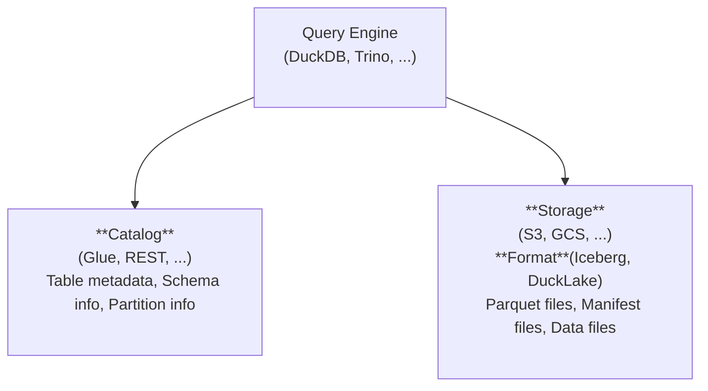

# Lakehouse <Badge type="warning" text="beta" />

> [!WARNING]
> Lakehouse support is currently in **beta**. APIs and configuration may change in future releases.

Bruin supports querying open table formats (Iceberg, DuckLake; Delta planned) stored in cloud object storage through various query engines. Start with the engine-specific docs: [DuckDB](./duckdb.md) or [Trino](./trino.md).

## What is a Lakehouse?

A lakehouse combines the scalability of data lakes with the reliability of data warehouses. Data is stored in open formats on object storage (S3, GCS, Azure Blob) while metadata catalogs track schema, partitions, and table history.

<!-- Architecture -->



## Quick Start

Add a lakehouse configuration to your DuckDB connection:

```yaml
connections:
  duckdb:
    - name: "analytics"
      path: "./path/to/duckdb.db"
      lakehouse:
        format: iceberg
        catalog:
          type: glue
          catalog_id: "123456789012"
          region: "us-east-1"
          auth:
            access_key: "AKIA..."
            secret_key: "..."
        storage:
          type: s3
          region: "us-east-1"
          auth:
            access_key: "AKIA..."
            secret_key: "..."
```

Then query your Iceberg tables (defaults to the `main` schema):

```sql
SELECT * FROM users;
```

See the engine-specific pages [DuckDB](./duckdb.md) or [Trino](./trino.md) for detailed configuration options.
