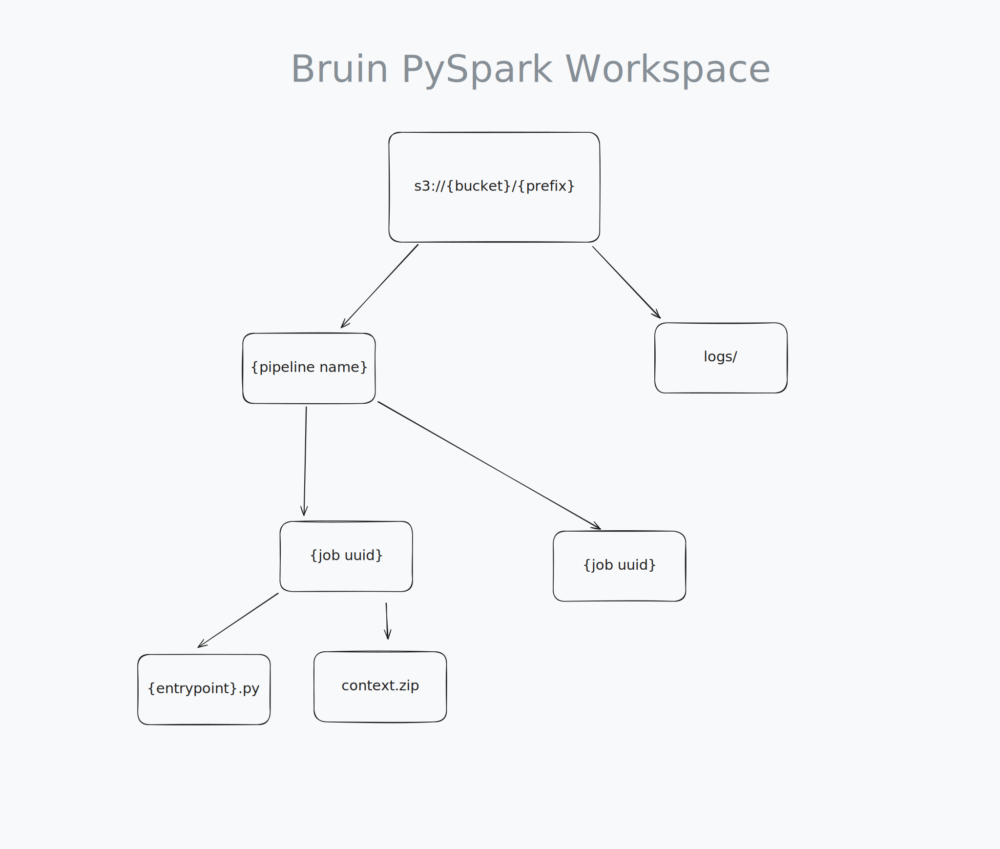

# AWS EMR Serverless Spark
Amazon EMR (Elastic MapReduce) Serverless is a deployment option for Amazon EMR that provides a serverless runtime environment. This simplifies the operation of analytics applications that use the latest open-source frameworks, such as Apache Spark and Apache Hive. With EMR Serverless, you don’t have to configure, optimize, secure, or operate clusters to run applications with these frameworks.

Bruin supports EMR Serverless as a data platform. You can use Bruin to integrate your Spark workloads into complex pipelines that use different data technologies, all without leaving your terminal. 

## Connection

In order to use bruin to run spark jobs in EMR Serverless, you need to define an `emr_serverless` connection in your `.bruin.yml` file. Here's a sample `.bruin.yml` with the required fields defined.

```yaml 
environments:
  default:
    connections:
      emr_serverless:

        # name of your connection
      - name: emr_serverless-default

        # AWS credentials
        access_key: AWS_ACCESS_KEY_ID
        secret_key: AWS_SECRET_ACCESS_KEY
        region: eu-north-1

        # name of your EMR application
        application_id: EMR_APPLICATION_ID

        # role assumed by your job. This determines
        # what AWS resources your spark job can access.
        execution_role: IAM_ROLE_ARN

        # (Python assets only)
        # declares working area used by pyspark jobs.
        workspace: s3://your-bucket/optional-prefix/

```


## Logs
Bruin supports log streaming for spark jobs. This is only supported for spark logs stored in [S3](https://docs.aws.amazon.com/emr/latest/EMR-Serverless-UserGuide/logging.html#jobs-log-storage-s3-buckets). Both `DRIVER` and `EXECUTOR` logs are streamed by default.

In order to stream logs, one of the following conditions must be met:
* Your EMR Serverless Application is pre-configured with an S3 Log Storage Location. 
* `parameters.logs` must be defined

> [!NOTE]
> Python assets stream logs out-of-the-box. You don't need to specify `parameters.logs` for them.

## Asset Types

Bruin supports two different ways of defining a Spark asset:
- what we call a "managed" PySpark asset where Bruin takes care of delivering the code to the cluster as well
- as an external asset defined with YAML where Bruin simply orchestrates

### Python Asset
A fully managed option where Bruin takes care of job setup, configuration, and execution. You only need to define the workload logic.

* Supports only PySpark scripts.
* Handles artifact deployment.
* Automatic log configuration.
* Concurrent-safe by default.
* Bundles internal dependencies and configures your job to use them.

#### Example: Standalone script
```bruin-python
""" @bruin
name: pyspark_job
type: emr_serverless.pyspark
connection: app_staging
parameters:
  workspace: s3://amzn-test-bucket/bruin-workspace/
@bruin """

from pyspark.sql import SparkSession

if __name__ == "__main__":
  spark_session = SparkSession.builder.appName("jobName").getOrCreate()
  run_workload(spark_session)
  spark_session.stop()

def run_workload(session):
  """
    crunch some numbers
  """
  ...

```

This defines a pyspark asset that will be executed by the EMR Serverless Application defined by the connection named `app_staging`. `s3://amzn-test-bucket/bruin-workspace/` is used as a working area that is used by bruin for uploading your job scripts, their dependencies and for storing logs.

The `run_workload` function is there for demonstration. You can structure your pyspark scripts however you like.

<!-- TODO: multi-module example -->

#### Workspace
Python assets require `workspace` to be configured in your `emr_serverless` connection. Workspace is a S3 path that is used by bruin as working storage for jobs that run on `emr_serverless`.

Bruin uses this for:
* Storing Logs
* Staging your entrypoint file
* Uploading bundled dependencies.



### YAML Asset
A lightweight option that only supports triggering a job. 

* Supports both PySpark scripts and JARs.
* Users are responsible for:
  * deploying their artifacts
  * managing internal dependencies

Choose the format that best fits your use case—use YAML when you want to integrate with pre-existing infrastructure, or use Python for a streamlined, fully-managed experience.


#### Example

```yaml
name: spark_example_job
type: emr_serverless.spark
connection: app_staging
parameters:
  entrypoint: s3://amzn-test-bucket/src/script.py
  config: --conf spark.executor.cores=1
```

This defines an asset that runs a spark job on an EMR Serverless Application defined by the connection named `app_staging`. The script at `s3://amzn-test-bucket/src/script.py` is configured as the [entrypoint](https://docs.aws.amazon.com/emr/latest/EMR-Serverless-UserGuide/jobs-spark.html#spark-params) of the job.

> [!note]
> YAML and Python assets require different `type` parameter.
> * YAML-style assets: `emr_serverless.spark` 
> * Python assets:  `emr_serverless.pyspark`.

## Asset Schema

Here's the full schema of the `emr_serverless.spark` asset along with a brief explanation:

```yaml
# required
name: spark_submit_test

# required, should be one of 
#   - emr_serverless.spark    (yaml)
#   - emr_serverless.pyspark  (python)
type: emr_serverless.spark 

# optional, defaults to emr_serverless-default
connection: connection-name-example  

# job specific configuration
parameters:

  # path of the pyspark script or jar to run (required) [yaml only]
  entrypoint: s3://amzn-test-bucket/src/script.py   

  # path where logs are stored or should be stored (optional)
  logs: s3://amzn-test-bucket/logs

  # args to pass to the entrypoint (optional)
  args: arg1 arg2

  # spark configuration (optional)
  config: --conf spark.executor.cores=1

  # timeout for the job, defaults to 0 which means no time limit (optional)
  timeout: 10m
```

For more details on EMR Serverless applications, see [AWS Documentation][emr-app]


[emr-app]: https://docs.aws.amazon.com/emr/latest/EMR-Serverless-UserGuide/emr-serverless.html