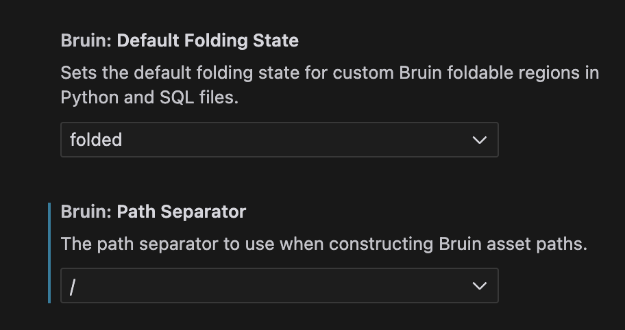

## Configuration

The Bruin VSCode extension is configurable, allowing users to tailor their experience according to their preferences. Users can adjust settings related to the folding behavior of Bruin sections and specify the default path separator used in the extension.

### Folding Behavior

Users can select whether they want the Bruin sections to be folded or expanded by default when opening a document. This setting can be adjusted in the extension settings under `Bruin > Default Folding State`. The available options are:
  - **Folded**: All Bruin sections will be collapsed by default.
  - **Expanded**: All Bruin sections will be open by default.

This feature enhances the readability of documents by allowing users to focus on relevant sections while minimizing distractions from other parts of the code.

### Path Separator

The extension also allows users to specify the default path separator to be used in file paths. While the extension automatically detects the operating system and adapts the path separator accordingly (using `\` for Windows and `/` for Unix-based systems), users have the flexibility to override this setting if needed.

- **Default Path Separator**: Users can set their preferred path separator in the extension settings under `Bruin > Path Separator`. This can be particularly useful for users who work in cross-platform environments or have specific requirements for path formatting.

### Accessing Configuration Settings

To access and modify the configuration settings for the Bruin extension:

1. Open Visual Studio Code.
2. Navigate to the **Settings** by clicking on the gear icon in the lower-left corner.
3. In the search bar, type "Bruin" to filter the settings related to the Bruin extension.
4. Adjust the settings for **Default Folding State** and **Path Separator** as desired.

