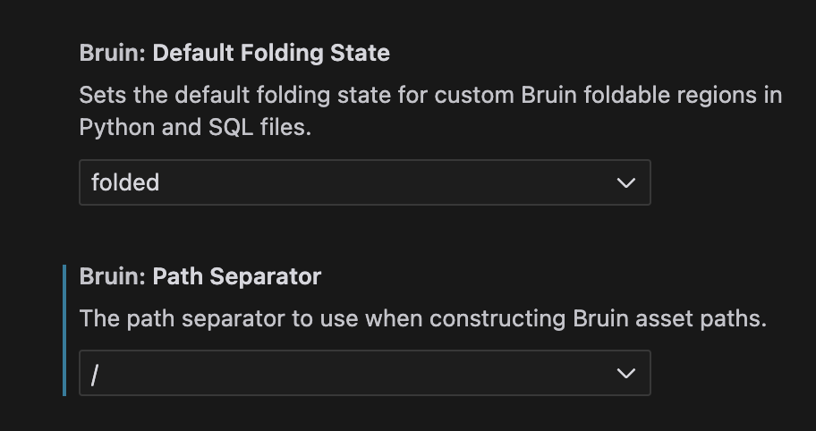

## Configuration

You can configure the Bruin extension from VS Code's settings. Open Settings (`Cmd/Ctrl + ,`), search for "Bruin", and adjust any of the options below.

### General

- **Folding State** (`bruin.FoldingState`): Whether Bruin sections are folded or expanded by default when you open an asset. Options: `folded`, `expanded`.
- **Path Separator** (`bruin.pathSeparator`): The separator used when building asset paths. Defaults to your operating system's (`/` on Unix, `\` on Windows).
- **SQLFluff Formatting** (`bruin.format.sqlfluff`): Format SQL files with SQLFluff. Off by default.
- **CLI Auto-Update** (`bruin.cli.autoUpdate`): Automatically update the Bruin CLI when a new version is available. On by default.
- **Telemetry** (`bruin.telemetry.enabled`): Send anonymous usage data to help improve the extension. On by default.

### Run option defaults

These set the default state of the checkboxes in an asset's run options:

- **Interval Modifiers** (`bruin.checkbox.defaultIntervalModifiers`): default for the `--apply-interval-modifiers` flag. Off by default.
- **Exclusive End Date** (`bruin.checkbox.defaultExclusiveEndDate`): default for using an exclusive end date. On by default.
- **Push Metadata** (`bruin.checkbox.defaultPushMetadata`): default for pushing metadata. Off by default.
- **Apply Sensor Mode** (`bruin.checkbox.defaultApplySensorMode`): default for applying the sensor mode. Off by default.

### Sensor mode

- **Sensor Mode** (`bruin.run.sensorMode`): the mode used when "Apply Sensor Mode" is enabled. Options:
  - `once` – run the sensor query once and continue based on the result.
  - `skip` – skip sensors entirely (useful for local development). This is the default.
  - `wait` – loop until the expected result is met (production-like behavior).

### Query preview

- **Preview Selected Query** (`bruin.query.previewSelectedQuery.enabled`): show the "Preview selected query" CodeLens when you select text in a SQL file. On by default.
- **Query Timeout** (`bruin.query.timeout`): timeout in seconds for query execution. Defaults to `1000`.

### Validation

- **Default Exclude Tag** (`bruin.validate.defaultExcludeTag`): a tag to exclude from validation by default.

### Accessing settings

1. Open VS Code Settings (`Cmd/Ctrl + ,`).
2. Search for "Bruin".
3. Adjust any of the settings above.

