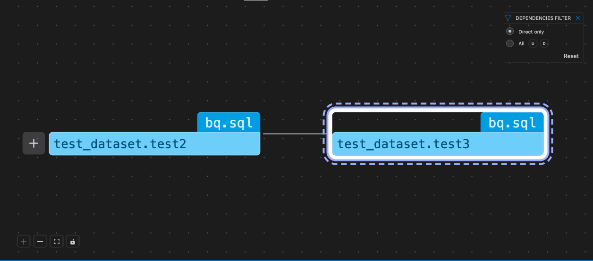

# Bruin VSCode Extension

The Bruin VSCode extension complements the Bruin CLI by offering a more visual and interactive approach to managing data pipelines. Integrated directly into VSCode, it simplifies tasks like building, managing, and deploying pipelines, making it easier for developers to interact with their projects.

## Syntax highlighting

Bruin has its own syntax for defining asset metadata, inside special markers. In order to make the experience of building Bruin pipelines easier, VS Code extension includes a built-in syntax highlighter, allowing you to easily navigate the configuration & code.

## Autocompletion & Snippets

Bruin VS Code extension includes autocompletion for Bruin [definitions](../assets/definition-schema), and validates the configuration. This allows you to quickly build models & easily identify mistakes in your asset definitions.

In addition, Bruin VS Code extension includes snippets to auto-generate full or partial configurations. Simply type `!fullsqlasset` and get a ready-to-go asset with all the fields filled out.

## Data Lineage

VS Code includes a built-in lineage panel that allows you to get a clear view of how data assets connect and interact.

## Rendered Jinja queries
Bruin supports [Jinja](../assets/templating/templating) out of the box, and while Jinja is powerful, it is often tricky to understand the resulting query. VS Code extension includes a built-in query renderer, which shows you the rendered version of the query, not just for Jinja but also [materialized](../assets/materialization.md) versions of any query.

## Local data catalog

VS Code extension visualizes Bruin definitions, including asset & column documentation. This means that you can simply view an asset file, and on the right side you can see all the relevant details about an asset, its columns, quality checks, and lineage.

## Bruin CLI integration

VS Code extension gives a visual way of working with Bruin pipelines. It integrates seamlessly with Bruin CLI, and allows you to validate, run and manage your assets from the interface.

## Real-time updates and feedback
The extension automatically runs things in the background and shows you feedback immediately as you type or change things.

