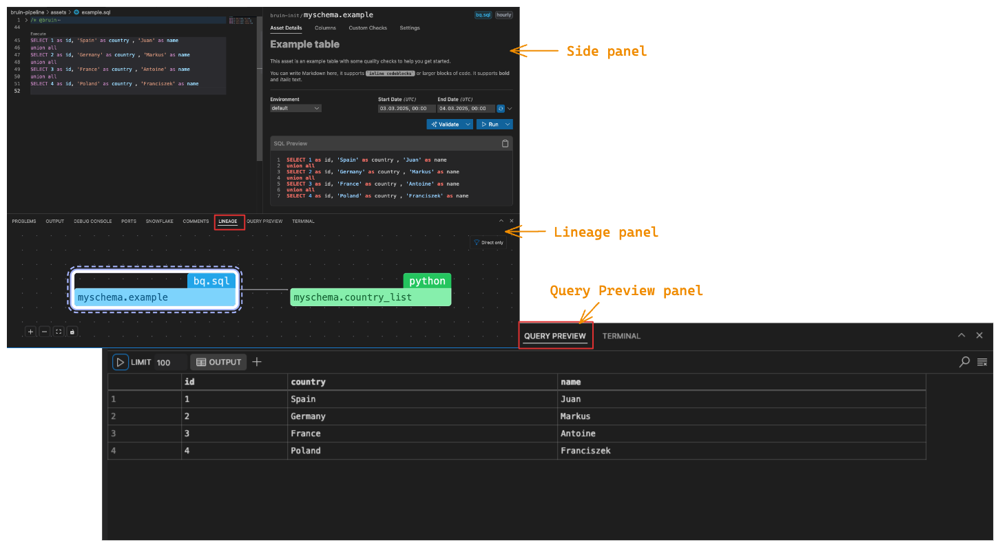

# Panels Overview  

The Bruin VSCode extension provides three main panels that help streamline your workflow: the Side Panel, the Lineage Panel, and the Query Preview Panel. 
Each panel offers specific functionality to enhance asset management, data lineage tracking, and query result visualization.

