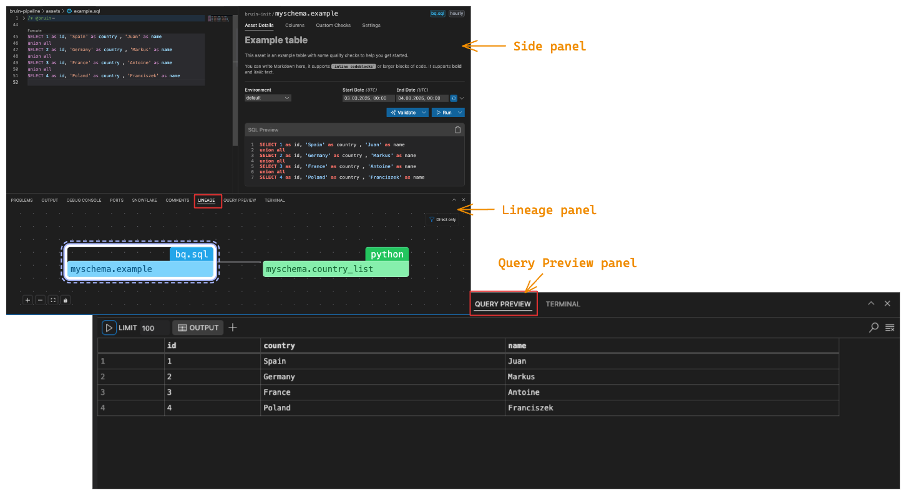

# Panels Overview  

The Bruin VS Code extension provides several panels that help streamline your workflow:

- **Side Panel** – the current asset's details, with tabs for general info, columns, details, custom checks, and settings.
- **Lineage Panel** – a visual view of how the asset connects to others.
- **Query Preview Panel** – run queries and view their results as a table.
- **Table Diff Panel** – compare two tables side by side.
- **Run History Panel** – review the history of your Bruin runs.

You'll also find the **Databases** view in the Activity Bar (left sidebar) for browsing your connections.

