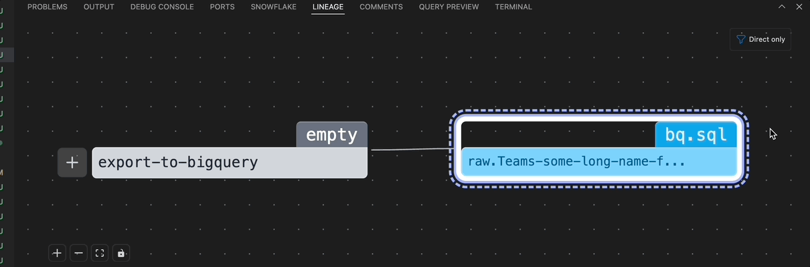

# Lineage Panel

The Lineage Panel is located at the bottom of the VS Code interface, near the terminal tab. It provides a visual representation of the current asset's lineage.

## Functionality
- **Display Asset Lineage**
    - Shows how the current asset is connected to others in the data pipeline.
    - The view updates automatically when changes are made or when switching to another asset.

- **Expand Dependencies**: 
    - The lineage panel includes an options menu, collapsed by default. When expanded, you can choose which part of the lineage to display: `All (downstream, upstream)`, only one of them, or `Direct Only` (with `Direct Only` selected by default).
    - Each downstream or upstream node that has further dependencies displays a plus button. Clicking this button expands the node to show the dependencies in the same direction.

- **Navigate to Node Asset**  
    - When you click on a particular node, a link appears that allows you to navigate directly to the corresponding asset file by clicking it.

- **Control panel**: 
    - A control panel allows you to zoom in and out, fit the view, or lock the nodes in place to prevent displacement.

- **Pipeline Lineage View** (New)  
    - A new **PipelineLineage** component has been added.
    - Navigation controls are now available in the expanded panel at the top right:
        - A **radio button** allows you to switch between `Asset View` and `Pipeline View`.
        - Selecting **Pipeline View** displays the data pipeline flow for the current asset.
        - In the **Pipeline View**, a button labeled **Asset View** appears in the top right. Clicking it switches back to showing the asset lineage for the current file.
    - This allows users to easily toggle between seeing an individual asset's lineage and its broader pipeline context.

## Column Level Lineage

The lineage panel now supports column-level lineage visualization, providing detailed insights into how individual columns flow through your data pipeline.

### Features
- **Column Level View**: Switch to column-level lineage to see how specific columns are transformed and used across assets
- **Highlighting Support**: Added highlighting functionality to make it easier to trace column relationships and dependencies
- **Interactive Navigation**: Click on columns to see their upstream and downstream relationships
- **Visual Clarity**: Enhanced visual representation makes it easier to understand complex column transformations

### How to Use Column Level Lineage

1. **Access Column View**: In the lineage panel options, select the column-level view mode
2. **Select Columns**: Click on specific columns to highlight their lineage paths
3. **Trace Dependencies**: Follow the highlighted paths to understand column transformations
4. **Navigate Relationships**: Use the interactive features to explore how columns relate across different assets

This feature is particularly useful for:
- **Data Governance**: Understanding data flow for compliance and auditing
- **Impact Analysis**: Assessing how changes to one column affect downstream processes  
- **Debugging**: Identifying where data transformations might be causing issues
- **Documentation**: Visualizing complex data relationships for team understanding

 
