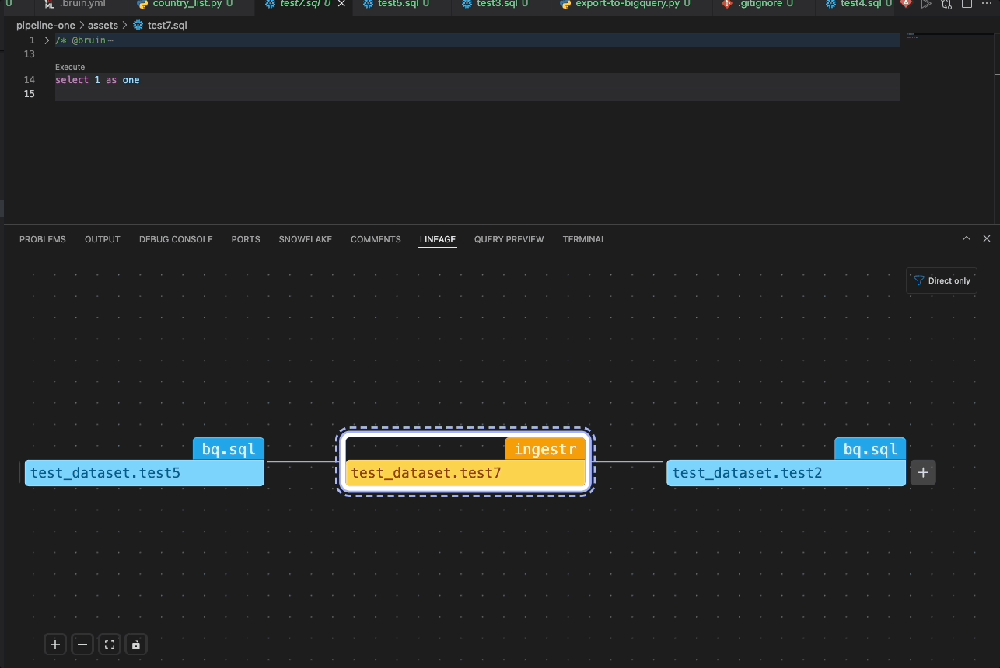

# Lineage Panel

The Lineage Panel is located at the bottom of the VSCode interface, near the terminal tab. It provides a visual representation of the current asset's lineage.

## Functionality
- **Display Asset Lineage**
    - Shows how the current asset is connected to others in the data pipeline.
    - The view updates automatically when changes are made or when switching to another asset.

- **Expand Dependencies**: 
    - The lineage panel includes an options menu, collapsed by default. When expanded, you can choose which part of the lineage to display: `All (downstream, upstream)`, only one of them, or `Direct Only` (with `Direct Only` selected by default).
    - Each downstream or upstream node that has further dependencies displays a plus button. Clicking this button expands the node to show the dependencies in the same direction.

- **Navigate to Node Asset**  
    - When you click on a particular node, a link appears that allows you to navigate directly to the corresponding asset file by clicking it.

- **Control panel**: 
    - A control panel allows you to zoom in and out, fit the view, or lock the nodes in place to prevent displacement.

 
