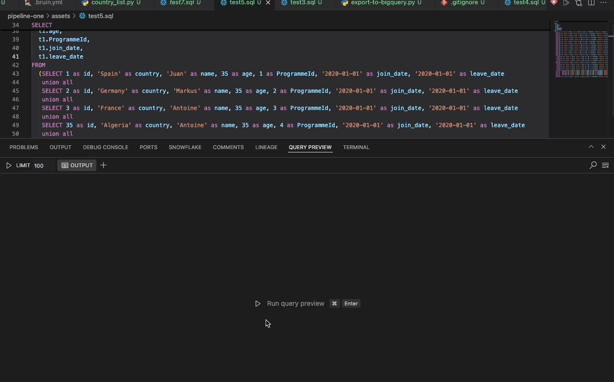

# Query Preview Panel
The Query Preview Panel is located at the bottom of the VS Code interface, near the `Lineage` Panel. It offers a visual representation of the query output, displayed as a table.

## Functionality
- **Display Query Output**  
    - A **Run** button is available, along with the keybindings `Ctrl + Enter` (Windows) or `Cmd + Enter` (Mac). Clicking the button will execute the entire query for the asset and display the result.  
    - The query must be located in a valid Bruin asset, random files are not supported at this time.  
    - You can also select a part of the query to run. When you highlight a subquery and click **Run**, only the selected query will be executed, and the result will be shown.  
    - **Limit**: The maximum number of rows displayed in the query output is limited to `1000`. This limit is editable, but it cannot exceed `1000` rows.  
    - **Clear Icon Button**: Clears the results of the current query output.  
    - **Search**: Allows you to search for specific words within the query output. The number of matches found is displayed along with the total number of rows.
    - **Pagination**: Added pagination support to navigate through large query results efficiently.

- **Query Timeout and Cancellation**
    - **Timeout Support**: Queries now support configurable timeout settings to prevent long-running queries from blocking the interface.
    - **Query Cancellation**: You can cancel running queries using the cancel button that appears during query execution.
    - **Improved Performance**: Better handling of query execution with enhanced timeout management.

- **Multi-Tab Functionality**  
    - Multiple queries can be run in separate tabs, allowing you to add or delete tabs as needed. When you run a query, the output is displayed in the current tab, while the other tabs retain their individual query outputs.  
    - **Search** and **Clear** work independently within each tab, just as the **Run** function does.

    
