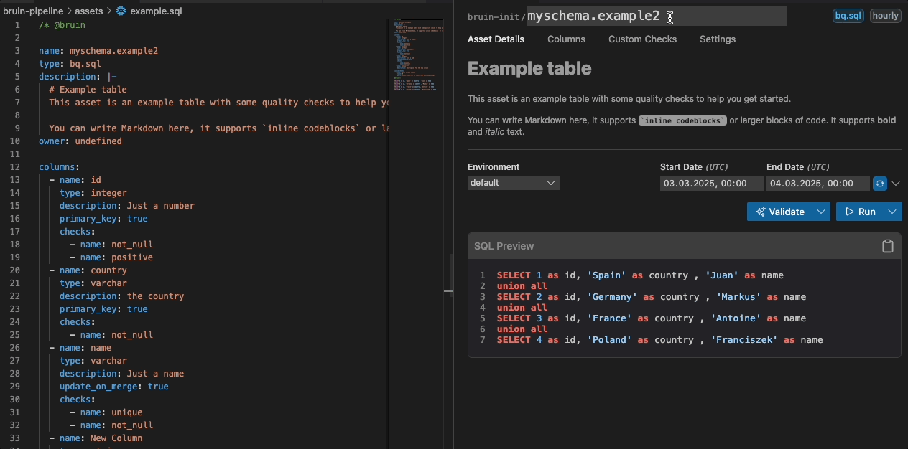
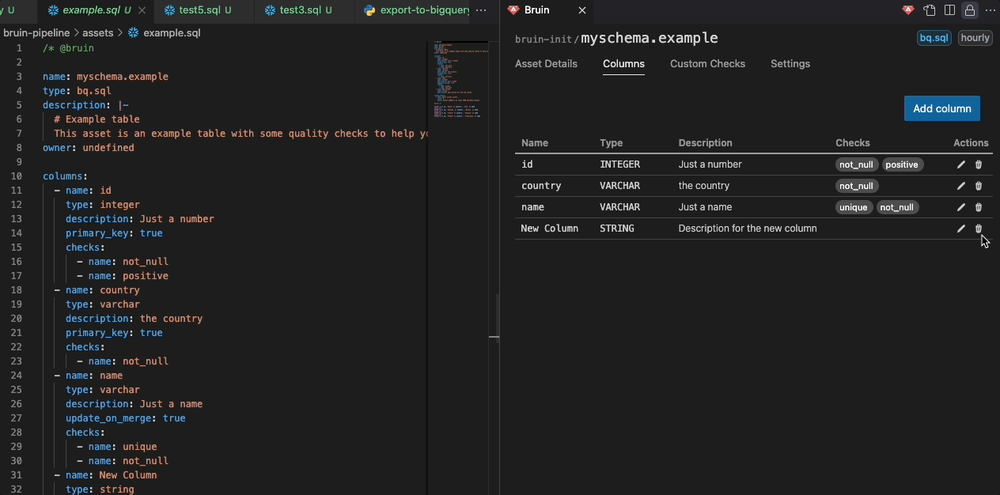
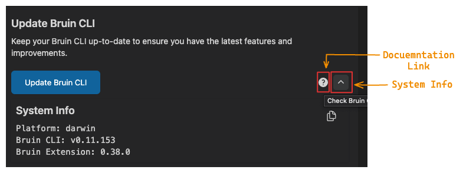
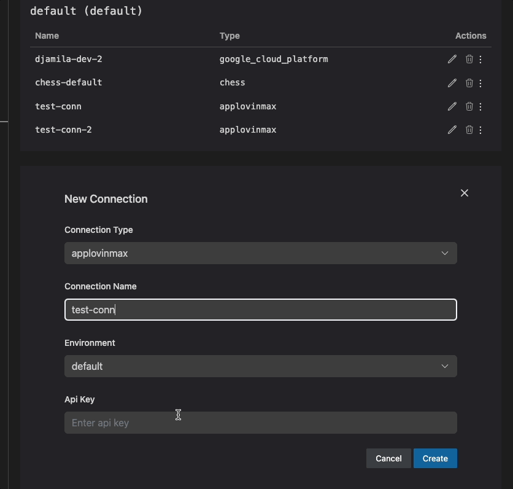

# Side Panel

The Side Panel in the Bruin VSCode extension gives you a comprehensive view of the current asset's details and includes four tabs for easy navigation.

## Tabs Overview

### 1. Asset Details
This tab provides a comprehensive view of your asset, allowing you to manage key information and execute actions directly from the UI.

- **Pipeline & Asset Name**: Displays the current pipeline and asset names. The asset name can be updated from the UI.
- **Pipeline Schedule & Asset Type**: Displays the current pipeline schedule and asset type as tags.
- **Description**: View or edit the asset’s description to document its purpose.
- **Environment Dropdown**: Seamlessly switch between environments (e.g., `development`, `production`).
- **Date Inputs**: 
    - Customize the date/time for runs directly within the UI. 
    - A refresh button allows synchronization with the pipeline schedule.
    - *Note*: The time is specified in `UTC`.
- **SQL Preview**: Displays a preview of the SQL query related to the asset for quick inspection.

### 2. Columns
- Lists the columns associated with the asset.
- *Each column shows*:
  - **Name**: The name of the column.
  - **Type**: The data type of the column (e.g., string, number).
  - **Quality Checks**: Any quality checks linked to the column.
  - **Description**: A brief description of the column's purpose.
  - **Glossary Integration**:
    - Columns sourced from the Glossary are marked with a link icon.
    - Clicking the link opens the corresponding glossary for more details.
- *Edit Capability*:
  - **Edit Name, Type, and Description**: Modify column properties directly within the UI.
  - **Add or Remove Columns**: Easily insert new columns or delete existing ones.
  - **Manage Quality Checks**: Add or remove quality checks.

### 3. Settings
The Settings tab has two main sections:

#### a. Bruin CLI Management
- **Install & Update**: Easily install or update the Bruin CLI directly from the UI.
- **Quick Documentation Access**: A dedicated button redirects you to the Bruin documentation for reference.
- **Version Details & Debugging**: A chevron down arrow expands to reveal:
  - Bruin CLI version
  - Your operating system version
  - VS Code extension version
  - These details can be copied for debugging purposes.

#### b. Connection Management
- You can manage your connections, including:
  - **Add Connection**: Add new connections by entering the required credentials. If the connection name already exists in the same environment, an error will be displayed.
  - **Duplicate Connection**:  If some connections share similar credentials, it's easier to duplicate and modify them as needed. This is fully supported.
  - **Update Connection**: Update existing connections.
  - **Delete Connection**: Delete existing connections.  
  - **Test Connection**: This allows you to test your connection directly from the UI. Unsupported connections will display a message indicating they cannot be tested.

