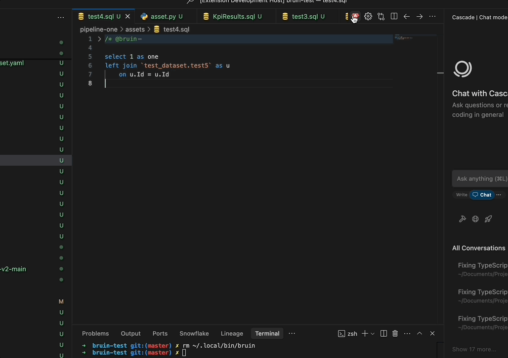
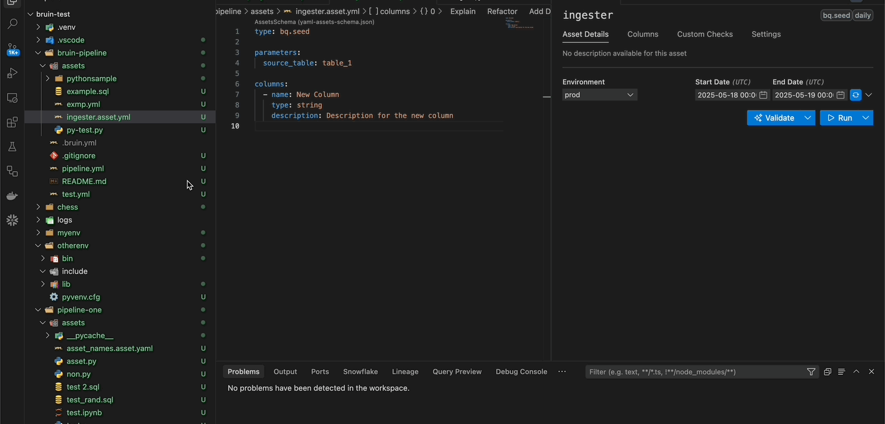
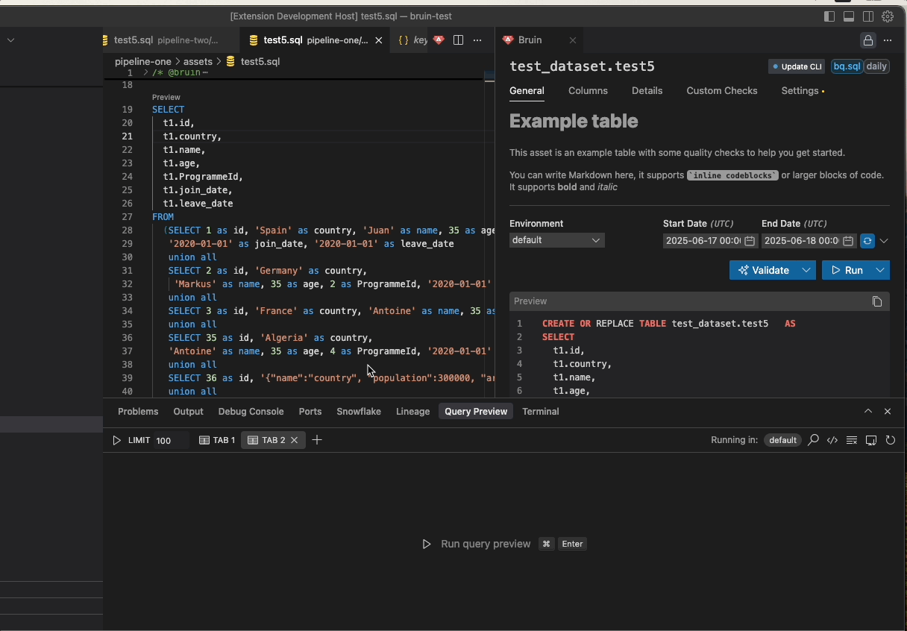

# Editor Experience
These in-editor features appear automatically based on file context or environment setup, helping you take quick action without leaving the editor.

## CLI Installation Prompt
If the Bruin CLI is not installed, the extension helps you get set up with minimal friction.

* **Trigger Condition**
  * Triggered when you click the Render button and the CLI is missing.

* **How It Works**
  * An alert is shown in the side panel.
  * A **"Install CLI"** button allows you to install the CLI immediately.

## File Conversion
When you open a file that isn't yet a Bruin asset but is eligible for conversion, the extension displays an alert offering a conversion option.

* **Eligible File Types**:
  * `.sql` and `.py`: Converted using the `patch-asset` command.
  * `.yml`: Converted by renaming to `*.asset.yml`.

* **How It Works**:
  * An alert appears when an eligible file is opened.
  * A **"Convert to Asset"** button is provided to initiate the conversion directly.

  

## Query Preview CodeLens
The extension offers an inline "Preview" button, leveraging CodeLens functionality, which appears above top-level queries in your SQL files. This feature provides a direct access to query previews from within the editor.

* **Functionality**
  * The "Preview" button is automatically displayed above each top-level query in your SQL files.
  * Clicking the button initiates query execution, displaying the results in the Query Preview Panel within the current tab.
  * This feature replicates the functionality of the Query Preview Panel.
* **Subquery Functionality**
  * When a subquery is selected and the "Preview" button is clicked, the results of the subquery are displayed.

## Language Server Protocol (LSP) Features
The extension provides intelligent autocomplete and validation for Bruin asset files through Language Server Protocol integration.

### Autocomplete Features
- **Materialization Completions**: Suggests materialization types (table, view, none) and strategies
- **Column Suggestions**: Suggests existing column names for partitioning and clustering
- **Dependency Completions**: Suggests pipeline assets from your current pipeline for dependencies
- **Asset Properties**: Autocomplete for asset structure and YAML formatting
- **Context-Aware**: Shows relevant suggestions based on your current position in the file

### Validation Features
- **Real-time Validation**: Checks asset structure and required fields as you type
- **Error Highlighting**: Highlights problematic code sections
- **Strategy Validation**: Validates fields based on your chosen materialization strategy

### Smart Features
- **Section Detection**: Identifies when you're in materialization, dependencies, or other sections
- **Indentation Help**: Validates proper YAML indentation
- **Descriptive Help**: Provides detailed descriptions for each completion option
- **Dependency Navigation**: Dependencies appear as clickable links (underlined)
  - Hover shows tooltip with "Go to [dependency_name]"
  - Clicking opens the dependency file in the editor

