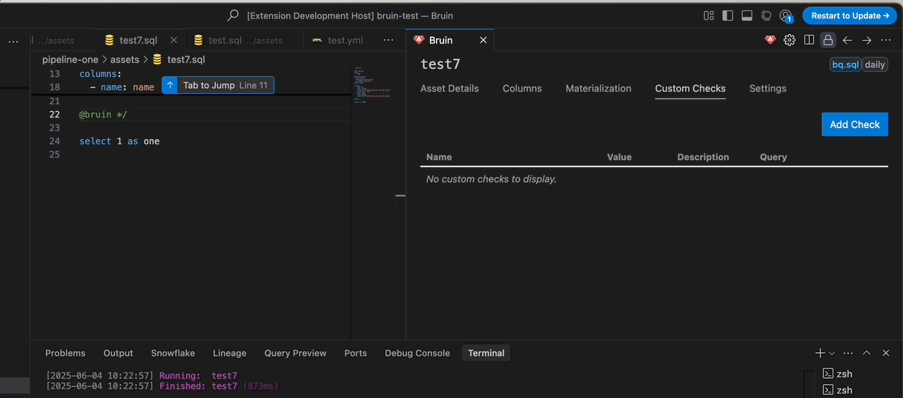

# Tabs Overview
These tabs give you direct access to view and manage details of the currently open Bruin asset.

## 1. General
This tab provides a comprehensive view of your asset, allowing you to manage key information and execute actions directly from the UI.

- **Pipeline & Asset Name**: Displays the current pipeline and asset names. The asset name can be updated from the UI.
- **Pipeline Schedule & Asset Type**: Displays the current pipeline schedule and asset type as tags.
- **Description**: View or edit the asset’s description to document its purpose.
- **Environment Dropdown**: Seamlessly switch between environments (e.g., `development`, `production`).
- **Date Inputs**: 
    - Customize the date/time for runs directly within the UI. 
    - A refresh button allows synchronization with the pipeline schedule.
    - *Note*: The time is specified in `UTC`.
- **SQL Preview**: Displays a preview of the SQL query related to the asset for quick inspection.

## 2. Columns
- Lists the columns associated with the asset.
- *Each column shows*:
  - **Primary Key**: Whether the column is a primary key.
  - **Nullable**: Whether the column can contain null values.
  - **Name**: The name of the column.
  - **Type**: The data type of the column (e.g., string, number).
  - **Quality Checks**: Any quality checks linked to the column.
  - **Description**: A brief description of the column's purpose.
  - **Owner**: The owner of the column.
  - **Glossary Integration**:
    - Columns sourced from the Glossary are marked with a link icon.
    - Clicking the link opens the corresponding glossary for more details.
- *Edit Capability*:
  - **Edit Name, Type, and Description**: Modify column properties directly within the UI.
  - **Add or Remove Columns**: Easily insert new columns or delete existing ones.
  - **Manage Quality Checks**: Add or remove quality checks.

### Fill from DB
The Columns tab includes a "Fill from DB" feature that allows you to automatically populate column information from your database:

- **Auto-populate Columns**: Retrieve column definitions directly from the connected database
- **Background Processing**: The fill operation runs in the background rather than in the terminal for a smoother experience
- **Column Sync**: Automatically sync column names, types, and constraints from your database schema

## 3. Details

The Details tab lets you configure asset metadata and database settings. It has a collapsible interface that auto-saves changes.

### Basic Information

#### Owner Management
- Click to edit owner with inline editing
- Changes auto-save

#### Tags Management
- Add/remove tags with inline editing
- Tags display as visual badges
- Changes update immediately

### Advanced Settings

#### Interval Modifiers
Set start/end intervals with units:
- **Start**: Beginning of the interval
- **End**: End of the interval  
- **Units**: months, days, hours, minutes, seconds

#### Partitioning
- Searchable dropdown to select partition columns
- Manual entry for expressions like `date(col_name)`
- Shows selected partition columns

#### Clustering
- Multi-select dropdown for cluster columns
- Checkboxes for easy selection

### Dependencies

#### Current Dependencies
- List of existing dependencies
- Type indicators (Pipeline/External)
- Dependency counts

#### Dependency Mode
- Toggle between "full" and "symbolic" modes
- Tooltips explain each mode

#### Pipeline Dependencies
- Searchable dropdown to find pipeline assets
- Multi-select support

#### External Dependencies
- Text input for external dependencies

#### Fill from Query
- Auto-populate dependencies from SQL analysis

### Materialization

#### Materialization Type
- Radio buttons: None/Table/View

#### Strategy Selection
Dropdown with strategies:
- **Create+Replace**: Drop and recreate table
- **Delete+Insert**: Delete existing data, insert new records
- **Append**: Add new rows without modifying existing
- **Merge**: Update existing rows, insert new ones
- **Time Interval**: Process time-based data
- **DDL**: Use DDL to create table
- **SCD2 by Time**: Slowly Changing Dimension Type 2 by time
- **SCD2 by Column**: Slowly Changing Dimension Type 2 by column

#### Advanced Options
- **Incremental Key**: Text input for incremental key column
- **Time Granularity**: Dropdown for date/timestamp granularity

### Interface Features

#### Collapsible Sections
- Expandable sections with chevron indicators
- Remembers collapsed/expanded state

## 4. Custom Checks
The Custom Checks tab allows you to manage custom checks for your assets directly from the UI.

### How to Use

1. **Add a Custom Check**:
   - Click the "Add Check" button.
   - Enter the details for your custom check:
     - **Name**: Provide a descriptive name.
     - **Value**: Set the expected value or threshold.
     - **Count**: Set the number of rows to check.
     - **Description**: Add a brief description of the check.
     - **Query**: Input the SQL query for validation.

2. **Edit a Custom Check**:
   - Click the edit icon (pencil) next to the check you wish to modify.
   - Make your changes in the provided fields.
   - Save your changes by clicking the save icon (checkmark), or cancel by clicking the cancel icon (cross).

3. **Delete a Custom Check**:
   - Click the delete icon (trash can) next to the check you want to remove.
   - Confirm the deletion in the dialog that appears.

4. **View Custom Checks**:
   - All custom checks are displayed in a table, showing their name, value, description, and query.
   - SQL queries are syntax-highlighted for clarity.

## 5. Settings
The Settings tab has two main sections:

### a. Bruin CLI Management
- **Install & Update**: Easily install or update the Bruin CLI directly from the UI.
- **Quick Documentation Access**: A dedicated button redirects you to the Bruin documentation for reference.
- **Version Details & Debugging**: A chevron down arrow expands to reveal:
  - Bruin CLI version
  - Your operating system version
  - VS Code extension version
  - These details can be copied for debugging purposes.

### b. Connection and Environment Management
- You can manage your connections, and environments, including:
  - **Add Environment**: Enter the name to add a new environment. This will display a new connection list with an empty connection, allowing you to add a new connection to this environment.
  - **Delete/Update Environment**: Inline edit existing environment name or delete the environment.
  - **Add Connection**: Add new connections by entering the required credentials. If the connection name already exists in the same environment, an error will be displayed.
  - **Duplicate Connection**:  If some connections share similar credentials, it's easier to duplicate and modify them as needed. This is fully supported.
  - **Update Connection**: Update existing connections.
  - **Delete Connection**: Delete existing connections.  
  - **Test Connection**: This allows you to test your connection directly from the UI. Unsupported connections will display a message indicating they cannot be tested.

