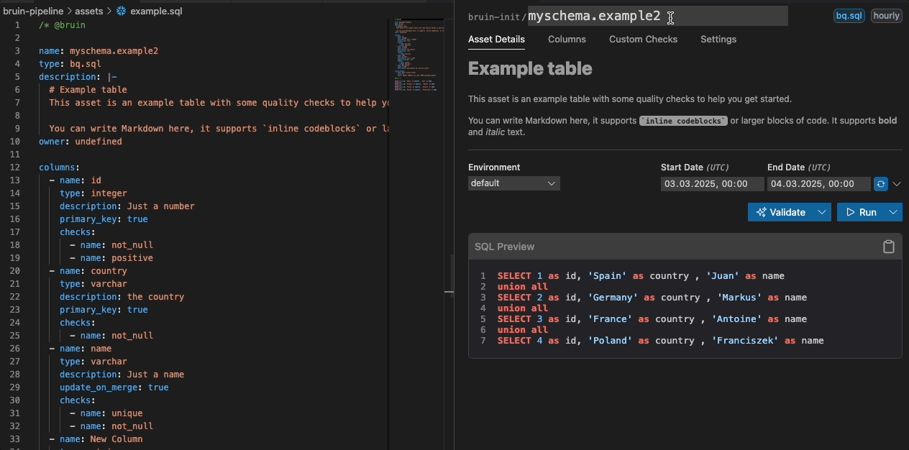
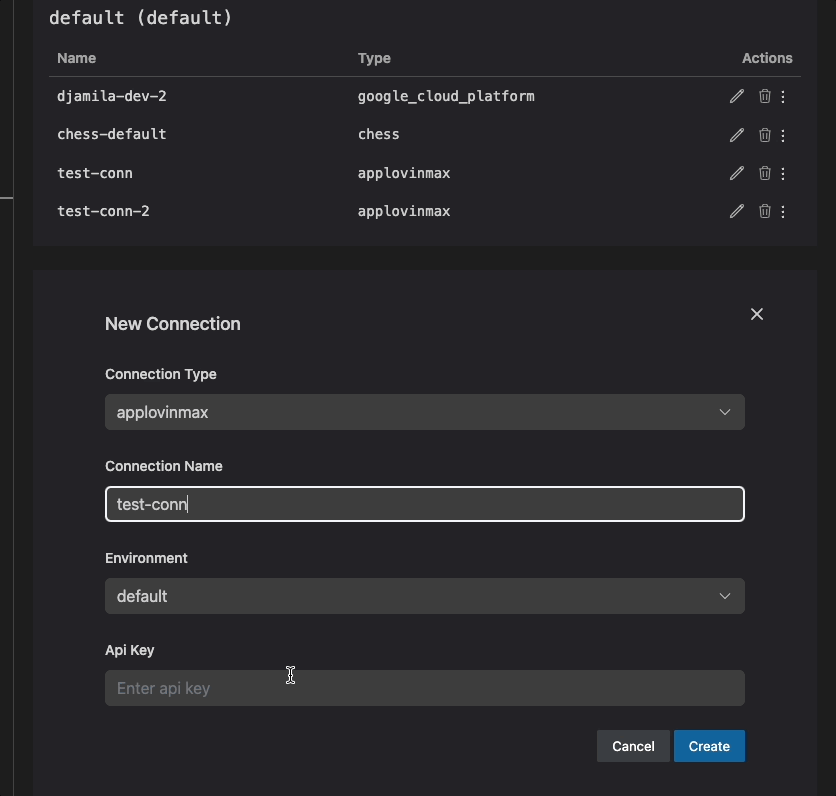

# Tabs Overview
These tabs give you direct access to view and manage details of the currently open Bruin asset.

## 1. Asset Details
This tab provides a comprehensive view of your asset, allowing you to manage key information and execute actions directly from the UI.

- **Pipeline & Asset Name**: Displays the current pipeline and asset names. The asset name can be updated from the UI.
- **Pipeline Schedule & Asset Type**: Displays the current pipeline schedule and asset type as tags.
- **Description**: View or edit the asset’s description to document its purpose.
- **Environment Dropdown**: Seamlessly switch between environments (e.g., `development`, `production`).
- **Date Inputs**: 
    - Customize the date/time for runs directly within the UI. 
    - A refresh button allows synchronization with the pipeline schedule.
    - *Note*: The time is specified in `UTC`.
- **SQL Preview**: Displays a preview of the SQL query related to the asset for quick inspection.

## 2. Columns
- Lists the columns associated with the asset.
- *Each column shows*:
  - **Name**: The name of the column.
  - **Type**: The data type of the column (e.g., string, number).
  - **Quality Checks**: Any quality checks linked to the column.
  - **Description**: A brief description of the column's purpose.
  - **Glossary Integration**:
    - Columns sourced from the Glossary are marked with a link icon.
    - Clicking the link opens the corresponding glossary for more details.
- *Edit Capability*:
  - **Edit Name, Type, and Description**: Modify column properties directly within the UI.
  - **Add or Remove Columns**: Easily insert new columns or delete existing ones.
  - **Manage Quality Checks**: Add or remove quality checks.

## 3. Materialization

The Materialization tab allows you to configure how your asset is materialized in the database. This includes setting the type of materialization, partitioning, clustering, and specifying strategies for data handling.

### Features:

- **Materialization Type**:
  - **None**: No materialization.
  - **Table**: Materialize the asset as a table.
  - **View**: Materialize the asset as a view.

- **Strategy** (for Tables):
  - **Create + Replace**: Drop and recreate the table completely.
  - **Delete + Insert**: Delete existing data using an incremental key and insert new records.
  - **Append**: Add new rows without modifying existing data.
  - **Merge**: Update existing rows and insert new ones using primary keys.
  - **Time Interval**: Process time-based data using an incremental key.
  - **DDL**: Use DDL to create a new table using the information provided in the embedded Bruin section.

- **Partitioning**:
  - Select a column or manually enter an expression to partition the table by. Supports expressions such as date(col_name) or timestamp_trunc(col2, hour).

- **Clustering**:
  - Select multiple columns to cluster the table by. Clustering organizes data storage based on the specified columns, which can improve query performance.

- **Owner and Tags**:
  - **Owner**: Set or edit the owner of the asset. This can be useful for identifying who is responsible for the asset.
  - **Tags**: Add or remove tags to categorize and filter assets.

### How to Use:

1. **Select Materialization Type**:
   - Choose between `None`, `Table`, or `View` using the radio buttons.

2. **Configure Strategy** (if Table is selected):
   - Select a strategy from the dropdown menu. Each strategy has a description to help you understand its use case.

3. **Set Partitioning**:
   - Click on the partitioning input field and select a column from the dropdown list to partition your table.

4. **Set Clustering**:
   - Click on the clustering input field and select one or more columns from the dropdown list to cluster your table.

5. **Set Owner and Tags**:
   - Edit the owner by clicking on the edit icon next to the owner field. Changes are saved immediately.
   - Add or remove tags by clicking on the add or remove icons next to the tags field. Changes are saved immediately.

6. **Save Changes**:
   - Click the "Save Changes" button to apply your materialization settings for partitioning, clustering, and strategy.

## 4. Custom Checks
The Custom Checks tab allows you to manage custom checks for your assets directly from the UI.

### How to Use:

1. **Add a Custom Check**:
   - Click the "Add Check" button.
   - Enter the details for your custom check:
     - **Name**: Provide a descriptive name.
     - **Value**: Set the expected value or threshold.
     - **Description**: Add a brief description of the check.
     - **Query**: Input the SQL query for validation.

2. **Edit a Custom Check**:
   - Click the edit icon (pencil) next to the check you wish to modify.
   - Make your changes in the provided fields.
   - Save your changes by clicking the save icon (checkmark), or cancel by clicking the cancel icon (cross).

3. **Delete a Custom Check**:
   - Click the delete icon (trash can) next to the check you want to remove.
   - Confirm the deletion in the dialog that appears.

4. **View Custom Checks**:
   - All custom checks are displayed in a table, showing their name, value, description, and query.
   - SQL queries are syntax-highlighted for clarity.

## 5. Settings
The Settings tab has two main sections:

### a. Bruin CLI Management
- **Install & Update**: Easily install or update the Bruin CLI directly from the UI.
- **Quick Documentation Access**: A dedicated button redirects you to the Bruin documentation for reference.
- **Version Details & Debugging**: A chevron down arrow expands to reveal:
  - Bruin CLI version
  - Your operating system version
  - VS Code extension version
  - These details can be copied for debugging purposes.

### b. Connection Management
- You can manage your connections, including:
  - **Add Connection**: Add new connections by entering the required credentials. If the connection name already exists in the same environment, an error will be displayed.
  - **Duplicate Connection**:  If some connections share similar credentials, it's easier to duplicate and modify them as needed. This is fully supported.
  - **Update Connection**: Update existing connections.
  - **Delete Connection**: Delete existing connections.  
  - **Test Connection**: This allows you to test your connection directly from the UI. Unsupported connections will display a message indicating they cannot be tested.

