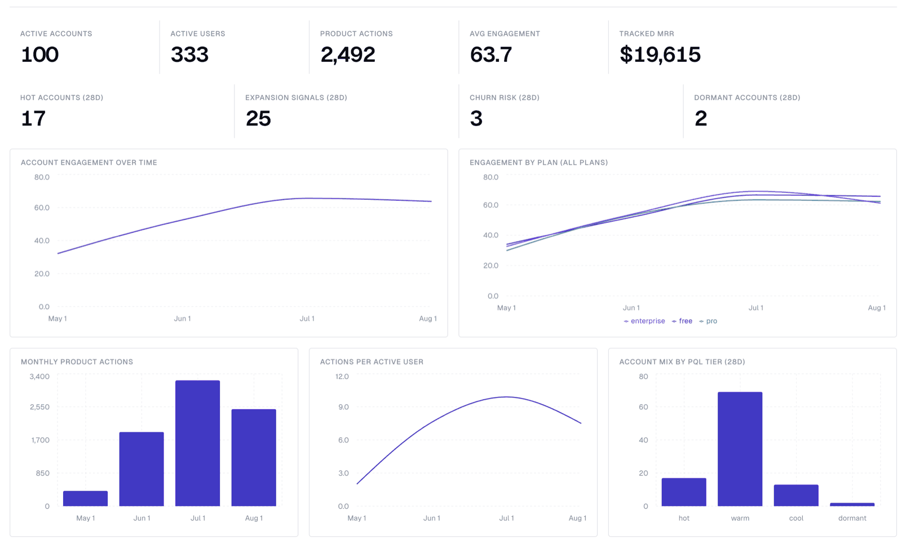
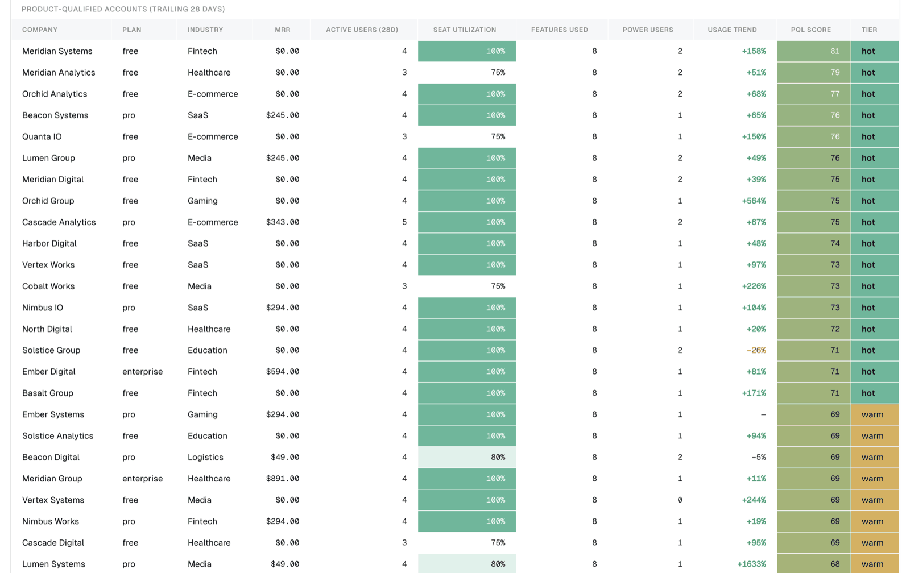
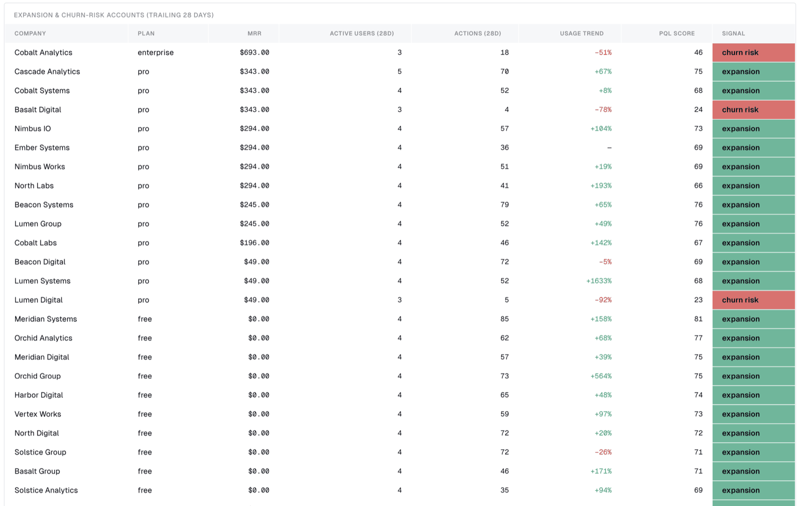
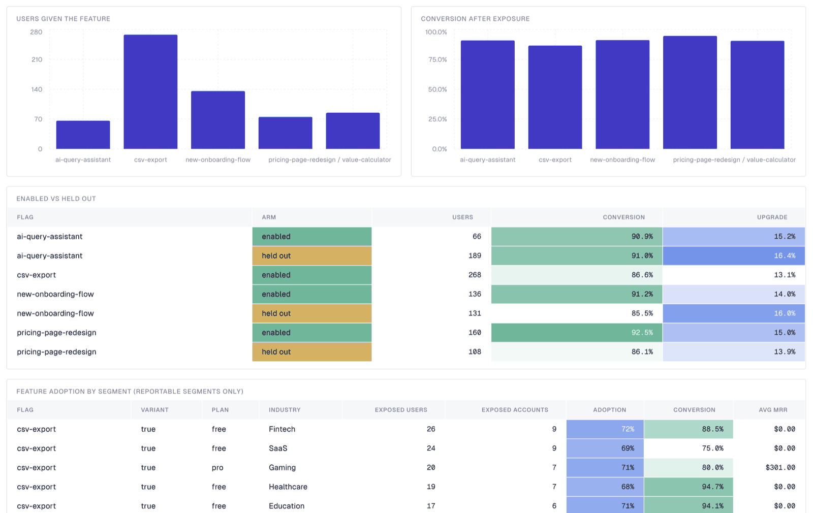
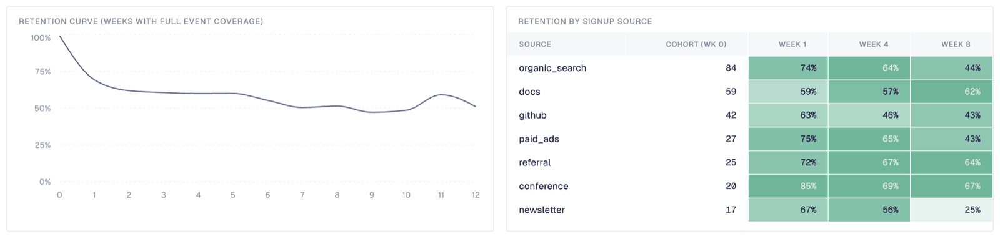

# PostHog Product Analytics to BigQuery

## At a glance

- Loads your PostHog events, people, and feature flags into BigQuery
- Cleans them into a tidy staging layer that is easy to query
- Merges each visitor's many IDs into one real person
- Groups events into sessions with duration, bounce, and conversions
- Builds four reports at the account and user-segment level
- Skips duplicate rows, so re-running a day stays correct
- Comes with a ready-made dashboard on top of the reports
- **Builds the foundational product-analytics models and context an AI agent can analyze and act on**

`posthog-bigquery` turns raw PostHog product analytics into warehouse-ready
account intelligence in BigQuery.

It lands `events`, `persons`, and `feature_flags` in BigQuery, models them into
a clean staging layer, and builds four reports — two at account grain, two
segmented — with a dashboard on top. 13 assets across three layers.

## Features

- **Identity resolution.** PostHog merges anonymous visitors into identified
  people over time, so one person accumulates several distinct IDs. The staging
  layer exposes `distinct_ids` as an `ARRAY<STRING>` so every event resolves to
  one person.
- **Safe re-runs.** The raw events table is append-only, so re-running a day
  duplicates rows. `posthog_stage.events` keeps the most recently loaded copy of
  each event id, making backfills idempotent.
- **Sessionization.** Duration, depth, entry/exit page, bounce, and conversion
  per session.
- **Retroactive account rollup.** Accounts are derived in SQL from the `company`
  property on the person profile, so PostHog's `$groups` never has to have been
  instrumented. It does still require `company` and `plan` on your person
  profiles — see [Adapt this to your project](#adapt-this-to-your-project).
- **Two tunable scores.** `engagement_score` and `pql_score`, both documented
  inline in the SQL with their weights spelled out.
- **One place to name your events.** Which events count as product work, as a
  conversion, as an upgrade, or as revenue is set by four pipeline variables, not
  scattered through the SQL.
- **Expansion and churn signals.** Free/pro accounts using the product like
  enterprise, and paying accounts whose usage is collapsing.
- **Typed schemas with quality checks.** Every column is declared and described;
  `metadata_push` sends those descriptions to BigQuery.
- **A DAC dashboard** over the reports layer, filterable by plan and date range.

## How this differs from PostHog out of the box

PostHog is good at what it does, and a lot of this template's value is *not* that
PostHog can't answer these questions — it's that the answers live in your
warehouse, next to everything else.

| | PostHog out of the box | This template |
| --- | --- | --- |
| **Account-level analysis** | Group Analytics, but only if you sent `$groups` on events at capture time. It cannot be applied retroactively, and it's a paid add-on. | Accounts are derived in SQL from person properties, so it works on events you already collected. If you never instrumented `$groups`, the account reports still build. |
| **Getting data out** | Batch export to BigQuery delivers the raw event stream. | The same data, plus deduplication, identity resolution, sessionization, account rollup, and reports — modeling, not just export. |
| **Joining to billing / CRM / support** | Not possible; PostHog only knows what you send it. | `posthog_stage.persons` exposes `company` and `email` as ordinary columns. Join them to your own tables and the reports gain real revenue context. |
| **Custom metrics** | Trends, funnels, retention, paths and stickiness, plus HogQL for anything else — but only over data PostHog holds. | The same SQL freedom over the joined warehouse. The PQL and engagement scores are weighted CTEs you can rewrite. |
| **Experiment readout** | Conversion per variant, with built-in significance testing. | The same exposure data crossed with plan, industry, and MRR — which variant won *among accounts worth money*. |
| **History** | Bounded by your plan's retention window. | Bounded by your warehouse, which is usually cheaper per GB-year. |

What PostHog still does better, and what this template does not replace: session
replay and heatmaps, real-time dashboards, built-in experiment statistics, and
requiring no pipeline to maintain. Run both — this is a complement to the PostHog
UI, not a substitute for it.

## Project structure

```text
posthog-bigquery/
├── pipeline.yml
├── README.md
├── macros/
│   └── posthog.sql
├── dashboards/
│   └── posthog-product-analytics.yml
└── assets/
    ├── posthog_raw/
    │   ├── events.asset.yml
    │   ├── persons.asset.yml
    │   └── feature_flags.asset.yml
    ├── posthog_stage/
    │   ├── events.sql
    │   ├── persons.sql
    │   ├── person_distinct_ids.sql
    │   ├── accounts.sql
    │   ├── sessions.sql
    │   └── feature_flag_exposures.sql
    └── posthog_reports/
        ├── account_engagement_monthly.sql
        ├── product_qualified_accounts.sql
        ├── feature_adoption_by_segment.sql
        └── weekly_retention_cohorts.sql
```

## What it creates

The `posthog_raw` dataset contains three tables, loaded by ingestr through the
shared `posthog-default` connection with BigQuery as the destination:

| Asset | Source table | How it loads |
| ----- | ------------ | ------------ |
| `posthog_raw.events` | `events` | Appends each run's window, filtered on `timestamp` |
| `posthog_raw.persons` | `persons` | Merges on `id`, tracked by `last_seen_at` |
| `posthog_raw.feature_flags` | `feature_flags` | Merges on `id`, tracked by `updated_at` |

The PostHog source handles incrementality itself, so the assets do not declare
a `materialization` block. Each table uses the primary key, incremental key,
and strategy that the source defines — see
[Available Source Tables](https://getbruin.com/docs/bruin/ingestion/posthog.html#available-source-tables)
for the full list, including `cohorts`, `annotations`, `event_definitions`, and
the `property_definitions:*` tables you can add the same way.

Each asset declares its column schema so the columns, descriptions, and quality
checks are pinned in BigQuery rather than inferred from whatever a run happens
to return. `metadata_push` is on in `pipeline.yml`, so those descriptions are
pushed to the BigQuery table and column metadata.

### Backfilling `events`: use one day per run

This matters more than anything else in the template.

PostHog's `/events` REST API — the endpoint ingestr reads — does not return a
complete history for a multi-day window, and gives no indication that anything
is missing. Measured against one project, `--full-refresh` each time, three
repeats per window (the results are deterministic):

| Window | Days | Events in PostHog | Events loaded | Days actually covered |
| ------ | ---- | ----------------- | ------------- | --------------------- |
| 3 days | 3 | 1,679 | 545 | 1 |
| 7 days | 7 | 3,090 | 2,619 | 7, but 15% short |
| 31 days | 31 | 16,925 | 673 | 1 |
| 95 days | 95 | 42,354 | 1,551 | 4 |
| 205 days, sparse | 205 | 141 | 141 | all — complete |
| one day | 1 | exact | exact | 93 days tested, all exact |

The loss is not a function of how wide the window is. A three-day window
returned a single day while a seven-day window spanned all seven, and a
205-day window over sparse data returned everything — so the limit tracks the
volume of events in the window, not its width. There is no usable rule to
exploit, because the seven-day case *looks* complete and is 15% short. **A
single day is the only window that is reliably exact.**

So backfill a day at a time. Note the end date is the *next* day: `bruin`
parses a bare date as midnight, so `--start-date D --end-date D` is a
zero-width interval and fails with `interval-start must be earlier than
interval-end`.

```bash
d=2026-05-23
while [ "$d" != "2026-08-22" ]; do
  nxt=$(date -j -v+1d -f %Y-%m-%d $d +%Y-%m-%d)   # GNU: date -d "$d +1 day" +%F
  bruin run assets/posthog_raw/events.asset.yml --start-date $d --end-date $nxt
  d=$nxt
done
```

The same off-by-one applies to any single-day run, including `persons` and
`feature_flags`: `--end-date 2026-08-21` stops at midnight, so a profile edited
at 06:50 that morning is outside the window.

`extract_partition_by` does not help here. Ingestr rejects it for this source —
"source table `events` does not support extract partitioning; supported sources
are postgres, mysql, mssql, sqlite, and ADBC-backed SQL sources" — because it
windows SQL extractions and PostHog is a REST source. It is also mutually
exclusive with `--full-refresh`.

Day-to-day scheduled runs are unaffected, since each one already covers a
single day. Only wide backfills are at risk.

`events` is also append-only, so re-running a day duplicates its rows. The
staging layer deduplicates on `id`, which makes re-runs safe.

`persons` and `feature_flags` merge on `id` and are unaffected by any of this.

### Staging: `posthog_stage`

Six models that make the raw payloads usable. Everything downstream reads these,
never `posthog_raw` directly.

| Asset | What it does |
| ----- | ------------ |
| `posthog_stage.events` | One row per event, deduplicated on `id`, with the common `properties` keys lifted into typed columns. Partitioned on `event_date`. |
| `posthog_stage.persons` | One row per person with `identify` attributes as typed columns, and `distinct_ids` as an `ARRAY<STRING>` so events resolve to a single person after identity merges. |
| `posthog_stage.person_distinct_ids` | The distinct-ID-to-person lookup, resolved to exactly one person per distinct ID. Everything that attributes an event to a person or an account joins through here. |
| `posthog_stage.accounts` | One row per company: plan, industry, seats, MRR, known users, licensed seats, and seat coverage. The account rollup lives here rather than being repeated in each report. |
| `posthog_stage.sessions` | Sessionized activity: duration, depth, entry/exit page, bounce, and whether the session converted. |
| `posthog_stage.feature_flag_exposures` | One row per `$feature_flag_called` event, joined to the flag definition. |

Three details worth knowing.

`posthog_raw.events` is append-loaded, so re-running a day duplicates rows
there; `posthog_stage.events` keeps only the most recently loaded copy of each
event id, which makes re-runs safe. The tiebreaker on `timestamp` keeps that
choice stable, so rebuilding from unchanged input gives an identical table.

PostHog merges anonymous visitors into identified people over time, so a person
owns several distinct IDs. `person_distinct_ids` is the single place that
resolution happens: it collapses the map to one person per distinct ID and
asserts that with a `unique` check, so no downstream join can quietly fan an
event out across two persons and inflate every count built on it.

`accounts` exists for the same reason. PostHog has no account entity unless
`$groups` was instrumented at capture time, so the rollup — highest plan tier
anyone holds, `MAX` of seats and MRR, modal industry — is derived once here
instead of being copy-pasted into four reports that could then drift apart.
An account whose people carry no recognized plan gets `unknown` rather than
`NULL`, so it stays reachable from the dashboard's plan filter.

### Reports: `posthog_reports`

| Asset | Grain | Why it isn't in PostHog |
| ----- | ----- | ----------------------- |
| `account_engagement_monthly` | company × month | Rolls person activity up to the company and scores it 0-100 against licensed seats, so a 3-seat startup and a 400-seat enterprise are comparable. Reaching this in PostHog needs `$groups` instrumented before the fact; here it is derived from person properties. |
| `product_qualified_accounts` | company snapshot | PQL scoring over the trailing 28 days, with `expansion_signal` (free/pro accounts using the product like enterprise) and `churn_risk_signal` (paying accounts whose usage is collapsing). Needs plan and MRR, which only exist in the warehouse. |
| `feature_adoption_by_segment` | flag × variant × plan × industry | An A/B readout crossed with revenue. PostHog can tell you a variant's conversion; it cannot tell you the variant won among enterprise fintech accounts worth $X MRR. `was_enabled` separates the rollout from the holdout, conversion is bounded by `conversion_window_days`, and `is_reportable` marks the cells large enough to read. |
| `weekly_retention_cohorts` | cohort week × source × plan | Retention sliced by acquisition source and plan together. `is_complete_week` guards both ends of the event history, so weeks the warehouse holds no data for are not reported as churn. |

Both scores are documented inline in the SQL. `engagement_score` weights seat
activation, depth, breadth, session depth, and consistency; `pql_score` weights
breadth, depth, seat activation, power users, and momentum. Adjust the weights —
they encode assumptions about your product, not universal truths.

Two things about those components are worth knowing before you trust a ranking.

**Seat activation is the heaviest component and the easiest to get backwards.**
It carries 30 engagement points and 20 PQL points, and its denominator —
`posthog_stage.accounts.licensed_seats`, set by the `seat_denominator`
variable — has to reconcile two different populations. `seats` comes from billing; the numerator counts people PostHog has
seen, which means people an `identify` call has run for. An account that bought
400 seats and rolled out to 40 reads as 10% activated, so left unqualified the
component ranks small accounts above large ones and inverts the plan comparison.
The default is therefore `LEAST(seats, known_users)`, which measures activation
against the reachable team and treats the gap to the contract as a coverage
question. Switch it back to `seats` in `accounts.sql` if your `identify`
coverage matches your billing — that is what `seat_denominator: contracted`
does. The seats information is not lost either way:
`posthog_stage.accounts.seat_coverage` reports known users over contracted seats
on its own, so a rollout that has not reached most of its licences shows up as a
coverage number rather than as a low engagement score.

**The score thresholds set queue length, not truth.** `pql_hot_score`,
`pql_warm_score`, `pql_cool_score`, and `expansion_min_score` decide how many
accounts land in front of a human, and the right numbers depend on how your
scores actually spread. On a test project where nearly every account was active,
the default `expansion_min_score` of 65 fired on a quarter of them — technically
correct, operationally useless. Look at `COUNTIF(expansion_signal) / COUNT(*)`
and the `pql_score` quartiles on your own data, then raise the thresholds rather
than the headcount.

**Breadth saturates.** It is a count out of `product_action_events`, so once an
account has touched every event on the list the component stops discriminating —
on one test project half the accounts sat at the ceiling. This is the one
component with no variable to tune, because the fix is a different measure rather
than a different constant: count distinct days per feature, or weight the rarer
actions, instead of the plain distinct count.

Account attributes come from `posthog_stage.accounts`, so the rollup rule is
stated once: plan is the highest tier held by anyone at the company, seats and
MRR are `MAX` (they repeat on every person row), industry is the modal value.
`persons` is a current-state snapshot with no history, so today's plan is
carried onto historical months.

### Dashboard

`dashboards/posthog-product-analytics.yml` is a [DAC](https://getbruin.com/docs/dac/)
dashboard over the reports layer: headline account KPIs, engagement trend by plan,
a PQL leaderboard with conditional formatting, an expansion/churn-risk table,
feature adoption, and retention.

Install a verified DAC release with the
[DAC installation guide](https://getbruin.com/docs/dac/getting-started/installation.html),
then, from the pipeline directory:

```bash
dac --config .bruin.yml validate --dir dashboards
dac --config .bruin.yml check --dir dashboards
dac --config .bruin.yml serve --dir dashboards --port 8321
```

The date-range filter drives the engagement, adoption, and retention widgets.
The product-qualified-account widgets are labelled "28d" because that report is
a trailing-28-day snapshot measured from the last day of event data, so it
deliberately does not move with the range.

**Account overview** — headline KPIs, engagement trend by plan, and the split of
accounts across PQL tiers.



**PQL leaderboard** — accounts ranked by product-qualified score, with the
seat, breadth, depth, and trend inputs behind each score.



**Expansion and churn risk** — paying accounts whose usage trend has moved far
enough to be worth a sales or success conversation.



**Feature adoption** — flag exposure and follow-on conversion, including the
enabled-versus-held-out comparison and per-segment adoption.



**Retention** — the weekly retention curve and week 1/4/8 retention broken out
by signup source.



Two widget conventions are deliberate. The adoption widgets filter on
`was_enabled`, so a boolean flag's `false` arm — everyone the rollout held out —
is not counted as having adopted the feature; the "Enabled vs Held Out" table is
where the two arms are compared. And the retention widgets filter on
`is_complete_week`, which excludes weeks at either end of the event history that
the warehouse cannot speak to.

## Adapt this to your project

Stripe and Shopify have fixed schemas. PostHog does not — every project invents
its own event names and person properties, so any PostHog template has to pick
examples and tell you where to change them. These are this template's.

**Event names** live entirely in `pipeline.yml`. Nothing in the SQL names an
event, so this is the only file you edit:

| Variable | Default | Drives |
| -------- | ------- | ------ |
| `product_action_events` | 8 Bruin-flavoured events (`pipeline_run_started`, `query_executed`, …) | `product_actions`, `features_used`, and the breadth and depth components of both scores |
| `conversion_events` | `signed_up`, `subscription_started` | `sessions.converted` |
| `upgrade_events` | `subscription_started` | `upgrade_rate` in the feature-adoption report |
| `revenue_events` | `invoice_paid`, `subscription_started` | which events may read `amount` as money (`$revenue` is always read) |

Two more variables govern how those events are counted rather than which ones
they are:

| Variable | Default | Drives |
| -------- | ------- | ------ |
| `conversion_window_days` | `14` | how long after a flag exposure an action still counts as caused by it |
| `min_segment_users` | `10` | smallest feature-adoption segment whose rates are marked `is_reportable` |

**Scoring knobs** are the other half of `pipeline.yml`. None of them are
universal truths, which is why they are config rather than SQL:

| Variable | Default | Drives |
| -------- | ------- | ------ |
| `seat_denominator` | `reachable` | whether seat activation is measured against known users or contracted seats |
| `pql_window_days` | `28` | length of the PQL trailing window and the prior window it is compared against |
| `pql_hot_score` / `pql_warm_score` / `pql_cool_score` | `70` / `45` / `20` | the `pql_tier` bands |
| `expansion_min_score` | `65` | how long the `expansion_signal` queue is |
| `depth_target_actions` | `40` | actions per active user that earn full marks on depth, in both scores |
| `session_depth_target_minutes` | `10` | mean session length that earns full marks on session depth |
| `power_user_min_actions` / `power_user_min_active_days` | `20` / `8` | what makes someone a power user |

Override any of them per run with `--var`, which parses values as JSON — so
numbers are bare and strings need quotes:

```bash
bruin run --var pql_hot_score=85 --var seat_denominator='"contracted"' my-posthog-pipeline
```

The `enum`, `minimum`, and `maximum` keywords on these variables are currently
documentation rather than enforcement — Bruin validates that a variable has a
default and little else, and `--var` overrides skip schema checks. Where getting
a value wrong would silently produce plausible-but-wrong numbers rather than an
obvious break, the SQL fails the run itself: an unrecognised `seat_denominator`
stops `posthog_stage.accounts` with
`seat_denominator must be "reachable" or "contracted", got …` instead of quietly
falling back to a default.

Two of these are worth checking against your own data before you trust a
ranking. `seat_denominator` decides whether the heaviest component measures
rollout or licence coverage, which [Reports](#reports-posthog-reports) covers in
full. And `depth_target_actions` sets where the depth component saturates: too
high and it reads near-zero for everyone, too low and it stops separating
accounts.

Replace `product_action_events` with the events that mean someone got real value
out of your product — the list length is the breadth denominator, so it scales
automatically. Leaving a list empty is fine; the predicate collapses to `FALSE`
and the pipeline still runs.

**Person properties** are set by your `identify` calls and read in
`assets/posthog_stage/persons.sql`. The template expects nine:

| Property | Used for | If you don't send it |
| -------- | -------- | -------------------- |
| `company` | The whole account layer | `accounts` is empty, and the two account-grain reports produce no rows |
| `plan` | Plan segmentation, expansion signal | Every account reads `unknown`; the plan filter still works |
| `seats` | Seat activation, the largest score component | Falls back to the count of known users, which is a reasonable proxy |
| `mrr` | Revenue-weighted everything | Money columns are null; the reports still rank on usage |
| `is_paying` | Churn-risk signal | Treated as false, so churn risk never fires |
| `industry` | Segment dimension | Reads `unknown` |
| `signup_source` | Retention by acquisition source | Reads `unknown` |
| `signup_date` | Retention cohorts | `weekly_retention_cohorts` produces no rows |
| `initial_plan` | Upgrade paths | Unused by the shipped reports |

The honest summary: send `company`, `plan`, and `signup_date` and everything
works. Send none of them and you still get a clean, deduplicated,
identity-resolved event and session layer — which is most of the value — but the
account reports will be empty.

If your properties have different names, change the `JSON_VALUE` paths in
`posthog_stage/persons.sql`. That is the only file that reads them.

## Setup

### 1. Create the pipeline

```bash
bruin init posthog-bigquery my-posthog-pipeline
```

### 2. Fill in the connections

Edit `.bruin.yml` with your GCP project and PostHog credentials:

```yaml
connections:
  google_cloud_platform:
    - name: gcp-default
      project_id: your-gcp-project-id
      location: your-gcp-region
      use_application_default_credentials: true
  posthog:
    - name: posthog-default
      personal_api_key: ${POSTHOG_PERSONAL_API_KEY}
      project_id: ${POSTHOG_PROJECT_ID}
      base_url: https://us.posthog.com
```

- `personal_api_key`: a PostHog [personal API key](https://posthog.com/docs/api#authentication)
  with read access to the project.
- `project_id`: the numeric project ID, visible in your PostHog project
  settings.
- `base_url`: `https://us.posthog.com` by default. Use `https://eu.posthog.com`
  for EU cloud, or your own host for self-managed PostHog.

The template reads the key and project ID from environment variables, so
export them before running:

```bash
export POSTHOG_PERSONAL_API_KEY=phx_...
export POSTHOG_PROJECT_ID=12345
```

### 3. Validate and run

```bash
bruin validate my-posthog-pipeline
bruin run my-posthog-pipeline
```

`bruin validate` currently reports `in_string_list is not callable` for the
assets that call the template's macros. The macros render correctly at run time;
validation does not load the `macros/` folder
([bruin#2588](https://github.com/bruin-data/bruin/issues/2588)).

To load history, backfill `posthog_raw.events` with the one-day-per-run loop in
[Backfilling `events`](#backfilling-events-use-one-day-per-run) — a wider window
silently returns partial data — then build everything downstream in a single
pass:

```bash
bruin run --exclude-tag posthog_raw my-posthog-pipeline
```

## Extending the template

- **Add more source tables.** Copy one of the asset files, change `name` and
  `source_table`, and drop it in `assets/posthog_raw/`. The shared ingestr
  parameters come from the `default` block in `pipeline.yml`.
- **Join to your own data.** The point of the staging layer is that
  `posthog_stage.persons.company` and `email` are ordinary columns. Join them to
  your CRM accounts or billing tables and the reports gain real revenue context
  instead of the seeded `mrr` property.
- **Partition the events table.** For large projects, add a
  `materialization` block to `events.asset.yml` with `partition_by: timestamp`
  to keep BigQuery scan costs down.
- **Make `posthog_stage.events` incremental.** Every model here is a full rebuild, which
  is fine at template scale and gets expensive once the event table is large,
  since it is re-read in full on every run. Switching it to a
  `time_interval` materialization on `event_date` is the highest-value change;
  the reports downstream are small enough that rebuilding them is cheap.

## Documentation

- [PostHog ingestion](https://getbruin.com/docs/bruin/ingestion/posthog.html)
- [Ingestr assets](https://getbruin.com/docs/bruin/assets/ingestr.html)
- [BigQuery platform](https://getbruin.com/docs/bruin/platforms/bigquery.html)
