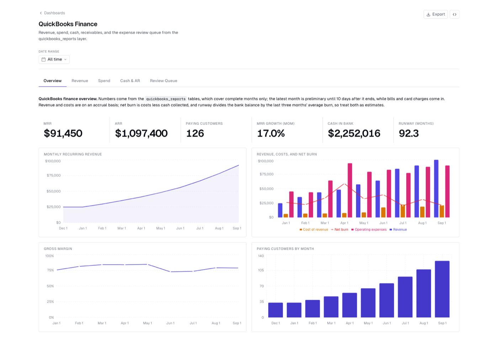

# QuickBooks to BigQuery

## At a glance

- Loads your QuickBooks Online customers, vendors, chart of accounts, invoices, payments, purchases, and bills into BigQuery
- Cleans them into typed staging tables, including invoice lines, payment-to-invoice links, and every spend line in one table
- Publishes finance reports: P&L, MRR movements, monthly KPIs, AR aging, collections, vendor spend, customer concentration, cash runway, and an expense review queue
- Maps your chart of accounts to P&L lines with an editable CSV
- Comes with a five-tab dashboard and an [agent guide](https://github.com/bruin-data/bruin/blob/main/templates/quickbooks-bigquery/AGENTS.md) for AI agents
- Documents every column and checks keys, amounts, and reconciliations on every run

`quickbooks-bigquery` is a QuickBooks Online finance pipeline for BigQuery, built for early-stage B2B SaaS companies. It loads seven QuickBooks Accounting API objects into the `quickbooks_raw` dataset with [ingestr](https://getbruin.com/docs/ingestr/supported-sources/quickbooks.html), cleans them into the `quickbooks_stage` dataset, and publishes finance reports in `quickbooks_reports`.

## Project structure

```text
quickbooks-bigquery/
├── .gitignore
├── pipeline.yml
├── README.md
├── AGENTS.md
├── dashboards/
│   └── quickbooks-finance.yml
├── images/
│   └── quickbooks-finance-dashboard.png
└── assets/
    ├── quickbooks_raw/
    │   ├── customers.asset.yml
    │   ├── vendors.asset.yml
    │   ├── accounts.asset.yml
    │   ├── invoices.asset.yml
    │   ├── payments.asset.yml
    │   ├── purchases.asset.yml
    │   └── bills.asset.yml
    ├── quickbooks_stage/
    │   ├── account_mapping.asset.yml
    │   ├── account_mapping.csv
    │   ├── account_categories.sql
    │   ├── customers.sql
    │   ├── vendors.sql
    │   ├── accounts.sql
    │   ├── invoices.sql
    │   ├── invoice_lines.sql
    │   ├── payments.sql
    │   ├── payment_applications.sql
    │   ├── bills.sql
    │   └── expense_lines.sql
    └── quickbooks_reports/
        ├── monthly_kpis.sql
        ├── monthly_pnl.sql
        ├── customer_mrr_movements.sql
        ├── customer_concentration.sql
        ├── ar_aging.sql
        ├── monthly_collections.sql
        ├── vendor_spend.sql
        ├── expense_review_queue.sql
        └── cash_runway.sql
```

## Get started

### Initialize the project

```bash
bruin init quickbooks-bigquery my-quickbooks-pipeline
```

Run the commands in this guide from the folder that holds `.bruin.yml`. Inside a Git repository that is the repository root; otherwise `bruin init` creates a `bruin/` folder for the project, so `cd bruin` first.

### Configure connections

`bruin init` adds placeholder connections to the project's `.bruin.yml`. Keep the connection names `gcp-default` and `quickbooks-default`, or rename them consistently in both `.bruin.yml` and `pipeline.yml`.

```yaml
default_environment: default

environments:
  default:
    connections:
      google_cloud_platform:
        - name: gcp-default
          project_id: your-gcp-project-id
          location: your-gcp-region
          use_application_default_credentials: true
      quickbooks:
        - name: quickbooks-default
          company_id: ${QUICKBOOKS_COMPANY_ID}
          client_id: ${QUICKBOOKS_CLIENT_ID}
          client_secret: ${QUICKBOOKS_CLIENT_SECRET}
          refresh_token: ${QUICKBOOKS_REFRESH_TOKEN}
          environment: production
```

#### BigQuery

Replace both placeholders:

- `project_id`: the Google Cloud project that owns the datasets this pipeline writes to, for example `my-company-finance`.
- `location`: the region or multi-region of those datasets, for example `US` or `EU`. See [BigQuery locations](https://cloud.google.com/bigquery/docs/locations).

The connection uses [Application Default Credentials](https://cloud.google.com/docs/authentication/application-default-credentials), so authenticate once with `gcloud auth application-default login`. To use a service account, replace `use_application_default_credentials: true` with `service_account_file: /path/to/service-account.json`. The credentials need permission to create datasets and tables and to run queries.

#### QuickBooks Online

The QuickBooks connection authenticates with an OAuth 2.0 app from the [Intuit Developer portal](https://developer.intuit.com/):

1. Create an app with the `com.intuit.quickbooks.accounting` scope and copy its **Client ID** and **Client Secret**. Use the development keys for a sandbox company and the production keys for your real books.
2. Open the [OAuth 2.0 Playground](https://developer.intuit.com/app/developer/playground), select your app and the accounting scope, and connect it to your company.
3. Copy the **Realm ID** (your `company_id`) and the **Refresh Token** from the playground.

Then export the values before running the pipeline:

```bash
export QUICKBOOKS_COMPANY_ID='9341450000000000'
export QUICKBOOKS_CLIENT_ID='AB...'
export QUICKBOOKS_CLIENT_SECRET='...'
export QUICKBOOKS_REFRESH_TOKEN='AB11...'
```

Set `environment: sandbox` when connecting to an Intuit sandbox company. Do not commit credentials.

Intuit rotates refresh tokens roughly once a day, and ingestr does not write the new token back to `.bruin.yml`. Once the token has rotated, runs fail with `invalid_grant` until you generate a new refresh token in the playground and update `QUICKBOOKS_REFRESH_TOKEN`. Keep this in mind before scheduling unattended runs.

### Load your data

Validate the project, then run the first load with `--full-refresh` over a window that covers every record edit in your company, from before the QuickBooks Online company was created up to now. The window filters on each record's QuickBooks `LastUpdatedTime`, not its transaction date, so an early start date loads records that haven't changed in years. The API does the filtering, so the early start date costs nothing extra:

```bash
bruin validate --fast my-quickbooks-pipeline
bruin run --full-refresh --start-date 2000-01-01 --end-date "$(date -u +%Y-%m-%dT%H:%M:%S)" \
  my-quickbooks-pipeline
```

The end time is the current UTC time, so today's edits are included. A date-only `--end-date` stops at midnight at the start of that day.

### Map your accounts

The reports group transactions into P&L lines with `assets/quickbooks_stage/account_mapping.csv`, which ships with a sample SaaS chart of accounts. After the first load, list the accounts it doesn't cover:

```bash
bruin query --connection gcp-default \
  --query "SELECT account_name, account_type, pnl_group, category FROM quickbooks_stage.account_categories WHERE NOT is_mapped"
```

Add a row for each one, and mark your subscription income accounts `is_recurring_revenue = true`, since MRR counts only invoice lines on those accounts. Then rebuild the account categories and reports without calling QuickBooks:

```bash
bruin run --downstream --end-date "$(date -u +%Y-%m-%dT%H:%M:%S)" \
  my-quickbooks-pipeline/assets/quickbooks_stage/account_mapping.asset.yml
```

See [Account mapping](#account-mapping) for the columns.

### Run it daily

After the first load, run the pipeline without `--full-refresh`. By default a run covers the previous UTC day, fetches the records updated inside that window, and merges them on `id`, so re-running a window never duplicates rows:

```bash
bruin run my-quickbooks-pipeline
```

Schedule that command with cron, [GitHub Actions](https://getbruin.com/docs/bruin/deployment/github-actions.html), or [another deployment option](https://getbruin.com/docs/bruin/deployment/overview.html). Each run needs a valid QuickBooks refresh token, so see the token note in [QuickBooks Online](#quickbooks-online) first.

## What it creates

### Raw QuickBooks data

| Schema | Asset | QuickBooks object | Materialization | Purpose |
| --- | --- | --- | --- | --- |
| `quickbooks_raw` | `customers` | `Customer` | `merge` on `id` | Customers and sub-customers with contact, terms, and open balance |
| `quickbooks_raw` | `vendors` | `Vendor` | `merge` on `id` | Suppliers, 1099 flags, payment terms, and open A/P balance |
| `quickbooks_raw` | `accounts` | `Account` | `merge` on `id` | The chart of accounts with type, sub-type, and current balance |
| `quickbooks_raw` | `invoices` | `Invoice` | `merge` on `id` | Sales invoices with line items, due dates, and open balance |
| `quickbooks_raw` | `payments` | `Payment` | `merge` on `id` | Customer payments received and the invoices they were applied to |
| `quickbooks_raw` | `purchases` | `Purchase` | `merge` on `id` | Cash expenses, checks, and credit card charges and refunds |
| `quickbooks_raw` | `bills` | `Bill` | `merge` on `id` | Vendor bills in accounts payable, with due dates and open balance |

QuickBooks nests references and line items, for example `customer_ref`, `line`, and `bill_addr`, and the pipeline keeps them as BigQuery `JSON` columns. A `*_ref` column holds `{"value": "<QuickBooks id>", "name": "<display name>"}`, so `JSON_VALUE(customer_ref.value)` joins an invoice to `quickbooks_raw.customers.id`.

### Staging models

The `quickbooks_stage` dataset turns the raw objects into typed tables with readable column names: `*_ref` columns become `*_id` and `*_name` columns, amounts become `NUMERIC` rounded to cents, and nested line arrays become one row per line. Every staging asset is rebuilt from the raw tables on each run.

| Asset | Grain | Purpose |
| --- | --- | --- |
| `customers` | One row per customer | Contact details, parent customer, terms, and open balance |
| `vendors` | One row per vendor | Contact details, 1099 flag, terms, and open A/P balance |
| `accounts` | One row per account | Chart of accounts with parent account and `financial_statement` (`balance_sheet` or `income_statement`) |
| `invoices` | One row per invoice | Amounts, tax, open balance, and `invoice_status`: `paid`, `partially_paid`, `open`, or `zero_amount` |
| `invoice_lines` | One row per product or discount line | Item, income account, quantity, unit price, and amount; discounts are negative |
| `payments` | One row per customer payment | Amount received, applied and unapplied amounts, and deposit account |
| `payment_applications` | One row per payment applied to an invoice | Applied amount, `days_to_pay`, and `days_past_due` for collections analysis |
| `bills` | One row per vendor bill | Amounts, open balance, and `bill_status` |
| `expense_lines` | One row per purchase or bill line | All spend in one table with payee, paid-from account, category account, and `is_expense` and `is_uncategorized` flags; card refunds are negative |
| `account_mapping` | One row per account name | Seed loaded from `account_mapping.csv`: the P&L section, report line, department, and MRR flag for each account |
| `account_categories` | One row per income-statement account | Every income and expense account with its P&L line, from the mapping or a default by account type |

`expense_lines` combines purchases and bills, so it holds every spend line whether it was paid at the point of sale or billed first. Lines are dated by their transaction, so a bill counts in the month it was billed, not the month it was paid. Lines can also post to balance sheet accounts, for example a check that pays off the credit card, so filter on `is_expense` for profit-and-loss spend; otherwise card payoffs double count the card charges. Item-based lines have a null `is_expense`: their item account is not loaded, so they can be an expense or an inventory purchase, and need a separate look. Filter on `is_uncategorized` to find spend still sitting in `Uncategorized Expense`, `Uncategorized Asset`, or `Ask My Accountant`.

### Account mapping

The reports group transactions into P&L lines through `assets/quickbooks_stage/account_mapping.csv`. Each row maps a QuickBooks account name to a P&L section (`revenue`, `cogs`, `operating_expense`, `other_income`, or `other_expense`), a report line such as `Payroll` or `Software`, an optional department, and whether the account counts toward MRR. The file ships with a typical SaaS chart of accounts. Edit it to match yours: an account it doesn't list still appears in the reports under a default line for its QuickBooks account type, with `is_mapped = false` in `account_categories`.

Mark your subscription income accounts `is_recurring_revenue = true`. MRR counts only invoice lines on those accounts, and a non-blocking check on `monthly_kpis` warns when a month has revenue but no MRR. Another check on `monthly_pnl` warns when an account with activity is missing from the CSV.

### Finance reports

The `quickbooks_reports` dataset answers the questions a founder or finance agent asks most. Month-based reports include complete months only, up to the run's end date, and `monthly_kpis` flags the latest month `is_preliminary` until `close_days` (10 by default, in `pipeline.yml`) after it ends, while bills and card charges are still being entered.

| Asset | Grain | Answers |
| --- | --- | --- |
| `monthly_kpis` | One row per month | MRR, ARR, paying customers, the MRR bridge, revenue, gross margin, operating expenses, cash collected, and net burn |
| `monthly_pnl` | Month, P&L section, line, and department | Accrual P&L: what did we spend on travel last month, what is our gross margin |
| `customer_mrr_movements` | Customer and month | Each customer's MRR and whether it was new, expansion, contraction, churn, or reactivation |
| `customer_concentration` | Paying customer, latest month | Share of MRR per customer, rank, cumulative share, trailing 12-month revenue, and what they owe |
| `ar_aging` | Open invoice | Who owes us money and how overdue it is, in `current`, `1-30`, `31-60`, `61-90`, and `90+` day buckets |
| `monthly_collections` | One row per month | Invoiced, collected, month-end receivables, DSO, days to pay, and on-time payment rate |
| `vendor_spend` | Payee | Total, recent, and trailing 12-month spend, estimated annual cost, main category, and recurring and new-vendor flags for SaaS tool sprawl |
| `expense_review_queue` | Flagged spend line | Lines to review: uncategorized, possible duplicates, amount spikes, unusual accounts, and new vendors, with a suggested account from the payee's history |
| `cash_runway` | One row | Cash, card balance owed, receivables, payables, average net burn over the last three months, and runway in months |

Revenue and costs are on an accrual basis: invoices count on their invoice date and bills on their bill date. `net_burn` is total costs less cash collected from customers and other income, so it approximates cash burn, and `runway_months` divides the bank balance by the three-month average. Treat both as estimates. MRR is the recurring revenue invoiced in the month, before discounts, with sub-customers rolled up to their parent. It assumes monthly billing: an annual invoice shows as a one-month spike followed by churn.

These reports only see invoices, purchases, and bills. Payroll booked as journal entries and revenue booked as sales receipts or deposits, which is how many Stripe integrations sync, are missing from the P&L, MRR, burn, and runway. Item-based spend lines are also left out, because their item account isn't loaded. Compare `monthly_pnl` with the QuickBooks Profit and Loss report before relying on it.

The review queue uses simple rules on the payee's history, so it flags candidates, not errors. Uncategorized lines stay in the queue until they are fixed; the other flags only cover the last `review_window_days` (90 by default, in `pipeline.yml`). A vendor that sells more than one thing, such as a cloud provider's conference, can be legitimately coded to several accounts.

### Governance

Every asset declares an `owner`, `domains`, `tags`, and `meta` with its grain and whether it holds personal data (`contains_pii`).

Every asset declares its full column schema with types, descriptions, and checks. `enforce_schema: true` passes those types to ingestr, and `metadata_push` in `pipeline.yml` publishes the descriptions to BigQuery. Report assets also list the questions they answer and notes for AI agents in `meta`, and custom checks reconcile them back to the staging tables: P&L net income to invoice and spend lines, the MRR bridge month over month, AR aging to the A/R account balance, and vendor spend and collections to their source lines. The staging and report models carry `unit_tests` that pin their logic (line signs, statuses, payment links, MRR movements, aging buckets, and review flags) against fixture rows; run them with `bruin unit-test my-quickbooks-pipeline`. They run as read-only queries on your BigQuery connection and write nothing. `bruin docs my-quickbooks-pipeline` builds a browsable documentation site from the same definitions.

## View the dashboard

`dashboards/quickbooks-finance.yml` is a [DAC](https://getbruin.com/docs/dac/getting-started/installation.html) dashboard with five tabs:

- **Overview**: MRR, ARR, paying customers, growth, cash, runway, and trends for revenue, costs, net burn, and gross margin
- **Revenue**: the MRR bridge, new and churned customers, top customers by MRR, and the latest month's MRR changes
- **Spend**: monthly costs by category, a P&L pivot by month, software tools by estimated annual cost, and top vendors
- **Cash & AR**: cash and card balances, receivables by age, invoiced against collected, DSO, and overdue invoices
- **Review Queue**: counts and the list of spend lines to review, with the reason and a suggested account

After the pipeline has run, [install DAC](https://getbruin.com/docs/dac/getting-started/installation.html), then validate the dashboard, execute its queries, and serve it from the folder that holds `.bruin.yml`:

```bash
dac --config .bruin.yml validate --dir my-quickbooks-pipeline/dashboards
dac --config .bruin.yml check --dir my-quickbooks-pipeline/dashboards
dac --config .bruin.yml serve --dir my-quickbooks-pipeline/dashboards --port 8321
```



The screenshot uses a synthetic sandbox company to show the layout.

## Use it with an AI agent

[`AGENTS.md`](https://github.com/bruin-data/bruin/blob/main/templates/quickbooks-bigquery/AGENTS.md) tells an AI agent which table answers which question, how MRR, net burn, runway, and DSO are defined, and how to run three workflows: a month-end review, categorizing uncategorized transactions with a confidence level for each, and checking duplicates and spikes. Codex reads `AGENTS.md` on its own; in Claude Code, mention it in your prompt, for example `@my-quickbooks-pipeline/AGENTS.md`. The agent queries BigQuery with `bruin query --connection gcp-default --query "..."`.

Ask questions like "who owes us money?", "what's our runway?", or "categorize last month's transactions and flag anything you're unsure about". The guide keeps the agent read-only: it proposes changes for a person to apply in QuickBooks.

## Loading behavior and caveats

- **Edits are captured.** An invoice paid, edited, or voided after it was created is reloaded by the run whose window covers the change, because QuickBooks bumps its `LastUpdatedTime`.
- **Deletes are not.** A transaction deleted in QuickBooks stays in `quickbooks_raw` at its last loaded version. If your team deletes transactions instead of voiding them, rerun the first-load command, with its `--start-date` and `--end-date`, now and then. A `--full-refresh` without those dates reloads only the previous day.
- **Inactive records.** The QuickBooks query API only returns active customers, vendors, and accounts. A record made inactive after it was loaded keeps its last loaded version, with `active = true`.
- **Not every transaction type is loaded.** Deposits, transfers, journal entries, credit memos, sales receipts, refunds, vendor credits, and bill payments are not supported by ingestr's QuickBooks source yet, so the pipeline does not build a general ledger or cash balance history, and the reports miss revenue and costs booked that way. Bill payments still show up as the drop in each bill's `balance`.
- **One currency.** Amounts are in each transaction's currency, which `currency_ref` records, and the reports add them up as if there were one. A non-blocking check on `monthly_pnl` warns when transactions in more than one currency were loaded.
- **Bundles are not expanded.** `invoice_lines` keeps product and discount lines but not the lines inside bundle (group) items. A non-blocking check flags invoices whose lines don't add up to the total.

## Customize it

- **Account mapping**: map each income and expense account in `account_mapping.csv` and mark your subscription accounts as recurring.
- **Placeholder accounts**: if your books park unclassified spend in accounts other than `Uncategorized Expense`, `Uncategorized Asset`, or `Ask My Accountant`, add them to the `is_uncategorized` list in `assets/quickbooks_stage/expense_lines.sql`.
- **Close and review windows**: change `close_days` and `review_window_days` in `pipeline.yml`.
- **Owner**: replace the placeholder owner `finance@example.com` in each asset.

Build further reports on the `quickbooks_stage` tables, and review the checks before relying on the data for financial reporting.
